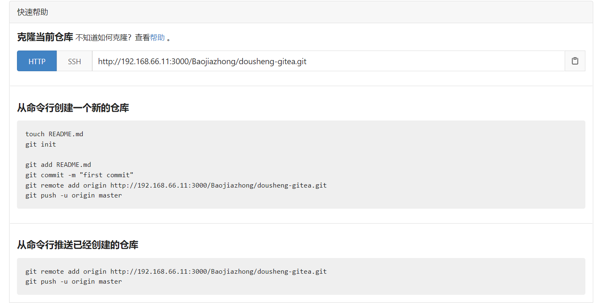

# 尝试复现easy_note的代码，弄清楚哪些是自动生成的，哪些是自己写的。

 

## 1.

mkdir easy_note

 

## 2.

go mod init github.com/cloudwego/kitex-examples/bizdemo/easy_note

 

## 3.

复制idl文件夹（其下包含两个idl文件，note.thrift 和 user.proto）

 

## 4.

kitex -module github.com/cloudwego/kitex-examples/bizdemo/easy_note -service demouser -type protobuf user.proto

注意：

-service 对应生成的build.sh中的RUN_NAME


在idl文件中的namespace名（也许都是全小写）对应kitex_gen下的一级目录名


在idl文件中的service名的全小写对应kitex_gen下的二级目录名


 

生成的目录结构


 

## 5.

生成的kitex_gen都会在idl目录下，当我们有多个idl文件时，idl下的一级文件（build.sh，handler.go,main.go,script/bootstrap.sh等）会冲突，

因此我们在项目根目录下新建文件夹kitex_gen文件夹，把userdemo和notedemo文件夹复制过去，


在根目录新建文件夹cmd/user 和 cmd/note，把对应kitex_gen的build.sh，handler.go,main.go,script/bootstrap.sh等文件复制过去


 

## 6.

demonote，重复上述过程

kitex -module github.com/cloudwego/kitex-examples/bizdemo/easy_note -service demonote note.thrift

 

## 7.

解决一下依赖问题：

go mod tidy

红色error: 路径中的“idl”删除


 我这边还会显示warnning，说是error信息不能用大写字母开头，我就忽视这个警告了。。。


## 8.

经过diff检查，自动生成的文件时一样的（除了版本号不同）

- diff kitex_gen/ ../kitex-examples/bizdemo/easy_note/kitex_gen/

- diff kitex_gen/userdemo/ ../kitex-examples/bizdemo/easy_note/kitex_gen/userdemo/

- diff kitex_gen/userdemo/userservice/ ../kitex-examples/bizdemo/easy_note/kitex_gen/userdemo/userservice/

- diff kitex_gen/notedemo/ ../kitex-examples/bizdemo/easy_note/kitex_gen/notedemo/

- diff kitex_gen/notedemo/noteservice/ ../kitex-examples/bizdemo/easy_note/kitex_gen/notedemo/noteservice/

- diff kitex_gen/notedemo/ ../kitex-examples/bizdemo/easy_note/kitex_gen/notedemo/


## 9.

完成pkg下的目录结构


 

## 10. constants

其下的 constant.go 定义了项目用到的配置相关的常量

total、notes、note_id 是 api 中要用的参数，响应要求的参数


## 11. errno

其下的 errno.go 定义了错误码


## 12. middleware

- client.go   客户端使用，在日志中打印server信息
- common.go   客户端和服务端通用，在日志中打印真实的请求、远程服务的信息以及真实响应（要执行next）
- server.go   服务端使用，在日志中打印client信息
- 注：var _ endpoint.Middleware 可能是先忽略编译器语法检查？


## 13. jaeger

链路追踪的初始化


**这是给config起了一个别名 叫 jaegercfg**

FromEnv，是在api的run.sh中导入环境变量。。应该是当次执行的终端生效。。。。


## 14. bound扩展

实现 TLS、限流、透传信息处理等

有很多接口

请求级别的限流

onRead()，看cpu占用率是否到达限制，到了返回error


## 15. docker-compose.yml

services：下面的多个容器构成一组服务

environment：设置环境变量


## 16. cmd/note

- Makefile：应该是服务端会执行这个代码生成？？？难道是代码生成的时候用了make命令？？？不懂。。。先copy过来吧。。。
- dal/ note服务相关的数据库操作，建表，增删改查等等
- pack/ 
- rpc/
- main.go：


## 17. cmd/user

类似上面


## 18. cmd/api


## 测试

用户注册（重复会正常报错）


用户登录


创建笔记


查询笔记


再查询一下


删除笔记


再查询一下


# 0519 班会


# gin-jwt

```go
// cmd/api/main.go
func main() {
	Init()
	r := gin.New()
	authMiddleware, _ := jwt.New(&jwt.GinJWTMiddleware{
		Key:        []byte(constants.SecretKey),
		Timeout:    time.Hour,
		MaxRefresh: time.Hour,
		PayloadFunc: func(data interface{}) jwt.MapClaims {
			if v, ok := data.(int64); ok {
				return jwt.MapClaims{
					constants.IdentityKey: v,
				}
			}
			return jwt.MapClaims{}
		},
		Authenticator: func(c *gin.Context) (interface{}, error) {
			var loginVar handlers.UserParam
			if err := c.ShouldBind(&loginVar); err != nil {
				return "", jwt.ErrMissingLoginValues
			}

			if len(loginVar.UserName) == 0 || len(loginVar.PassWord) == 0 {
				return "", jwt.ErrMissingLoginValues
			}

			return rpc.CheckUser(context.Background(), &userdemo.CheckUserRequest{UserName: loginVar.UserName, Password: loginVar.PassWord})
		},
		TokenLookup:   "header: Authorization, query: token, cookie: jwt",
		TokenHeadName: "Bearer",
		TimeFunc:      time.Now,
	})

	v1 := r.Group("/v1")
	user1 := v1.Group("/user")
	user1.POST("/login", authMiddleware.LoginHandler)
	user1.POST("/register", handlers.Register)

	note1 := v1.Group("/note")
	note1.Use(authMiddleware.MiddlewareFunc())
	note1.GET("/query", handlers.QueryNote)
	note1.POST("", handlers.CreateNote)
	note1.PUT("/:note_id", handlers.UpdateNote)
	note1.DELETE("/:note_id", handlers.DeleteNote)

	if err := http.ListenAndServe(":8080", r); err != nil {
		klog.Fatal(err)
	}
}
```

看一下 jwt.GinJWTMiddleware

```go
// GinJWTMiddleware provides a Json-Web-Token authentication implementation. On failure, a 401 HTTP response
// is returned. On success, the wrapped middleware is called, and the userID is made available as
// c.Get("userID").(string).
// Users can get a token by posting a json request to LoginHandler. The token then needs to be passed in
// the Authentication header. Example: Authorization:Bearer XXX_TOKEN_XXX

// GinJWTMiddleware提供了一个Json-Web-Token认证实现。 失败时，返回401 HTTP响应。 一旦成功，将调用包装的中间件，userID将以c.Get(“userID”)的形式提供。
// 用户可以通过发送一个json请求到LoginHandler来获得一个令牌。 然后需要在Authentication头中传递牌。 例如:授权:无记名XXX_TOKEN_XXX

// MapClaims type that uses the map[string]interface{} for JSON decoding
// This is the default claims type if you don't supply one
type MapClaims map[string]interface{}

type GinJWTMiddleware struct {
	// Realm name to display to the user. Required.
	Realm string

	// signing algorithm - possible values are HS256, HS384, HS512, RS256, RS384 or RS512
	// Optional, default is HS256.
	SigningAlgorithm string

	// Secret key used for signing. Required.
	Key []byte

	// Callback to retrieve key used for signing. Setting KeyFunc will bypass
	// all other key settings
	KeyFunc func(token *jwt.Token) (interface{}, error)

	// Duration that a jwt token is valid. Optional, defaults to one hour.
	Timeout time.Duration

	// This field allows clients to refresh their token until MaxRefresh has passed.
	// Note that clients can refresh their token in the last moment of MaxRefresh.
	// This means that the maximum validity timespan for a token is TokenTime + MaxRefresh.
	// Optional, defaults to 0 meaning not refreshable.
	MaxRefresh time.Duration

	// Callback function that should perform the authentication of the user based on login info.
	// Must return user data as user identifier, it will be stored in Claim Array. Required.
	// Check error (e) to determine the appropriate error message.
	Authenticator func(c *gin.Context) (interface{}, error)

	// Callback function that should perform the authorization of the authenticated user. Called
	// only after an authentication success. Must return true on success, false on failure.
	// Optional, default to success.
	Authorizator func(data interface{}, c *gin.Context) bool

	// Callback function that will be called during login.
	// Using this function it is possible to add additional payload data to the webtoken.
	// The data is then made available during requests via c.Get("JWT_PAYLOAD").
	// Note that the payload is not encrypted.
	// The attributes mentioned on jwt.io can't be used as keys for the map.
	// Optional, by default no additional data will be set.
	PayloadFunc func(data interface{}) MapClaims

	// User can define own Unauthorized func.
	Unauthorized func(c *gin.Context, code int, message string)

	// User can define own LoginResponse func.
	LoginResponse func(c *gin.Context, code int, message string, time time.Time)

	// User can define own LogoutResponse func.
	LogoutResponse func(c *gin.Context, code int)

	// User can define own RefreshResponse func.
	RefreshResponse func(c *gin.Context, code int, message string, time time.Time)

	// Set the identity handler function
	IdentityHandler func(*gin.Context) interface{}

	// Set the identity key
	IdentityKey string

	// TokenLookup is a string in the form of "<source>:<name>" that is used
	// to extract token from the request.
	// Optional. Default value "header:Authorization".
	// Possible values:
	// - "header:<name>"
	// - "query:<name>"
	// - "cookie:<name>"
	TokenLookup string

	// TokenHeadName is a string in the header. Default value is "Bearer"
	TokenHeadName string

	// TimeFunc provides the current time. You can override it to use another time value. This is useful for testing or if your server uses a different time zone than your tokens.
	TimeFunc func() time.Time

	// HTTP Status messages for when something in the JWT middleware fails.
	// Check error (e) to determine the appropriate error message.
	HTTPStatusMessageFunc func(e error, c *gin.Context) string

	// Private key file for asymmetric algorithms
	PrivKeyFile string

	// Private Key bytes for asymmetric algorithms
	//
	// Note: PrivKeyFile takes precedence over PrivKeyBytes if both are set
	PrivKeyBytes []byte

	// Public key file for asymmetric algorithms
	PubKeyFile string

	// Private key passphrase
	PrivateKeyPassphrase string

	// Public key bytes for asymmetric algorithms.
	//
	// Note: PubKeyFile takes precedence over PubKeyBytes if both are set
	PubKeyBytes []byte

	// Private key
	privKey *rsa.PrivateKey

	// Public key
	pubKey *rsa.PublicKey

	// Optionally return the token as a cookie
	SendCookie bool

	// Duration that a cookie is valid. Optional, by default equals to Timeout value.
	CookieMaxAge time.Duration

	// Allow insecure cookies for development over http
	SecureCookie bool

	// Allow cookies to be accessed client side for development
	CookieHTTPOnly bool

	// Allow cookie domain change for development
	CookieDomain string

	// SendAuthorization allow return authorization header for every request
	SendAuthorization bool

	// Disable abort() of context.
	DisabledAbort bool

	// CookieName allow cookie name change for development
	CookieName string

	// CookieSameSite allow use http.SameSite cookie param
	CookieSameSite http.SameSite
}
```




直接go mod tidy引入的thrift版本>0.13，接口不兼容：

```
go mod edit -replace github.com/apache/thrift=github.com/apache/thrift@v0.13.0
```

直接替换gorm.Model会有问题

要么每次转换一下int类型：int64(ui)


注册服务，调用两个微服务好了：创建用户，并且自动登录。。。


接口文档定义的是微服务，我感觉可以比接口文档更小、细节。完整功能可以在service中调用多个微服务实现


目前遇到的问题：windows下跑的安卓模拟器，但是请求打进虚拟机中的服务后没反应，显示重定向307


关于postman：网页端默认使用云端代理，所以不能访问localhost和私有地址（192.168.x.x)

解决办法：下载桌面端postman；或者下载桌面agent，然后在web端中选择桌面代理


大大大大进展：！！！ login后面要加/，否则重定向不了~~~
