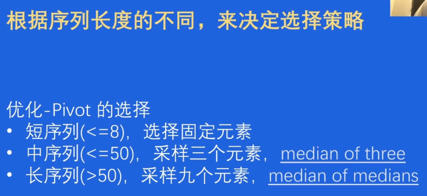
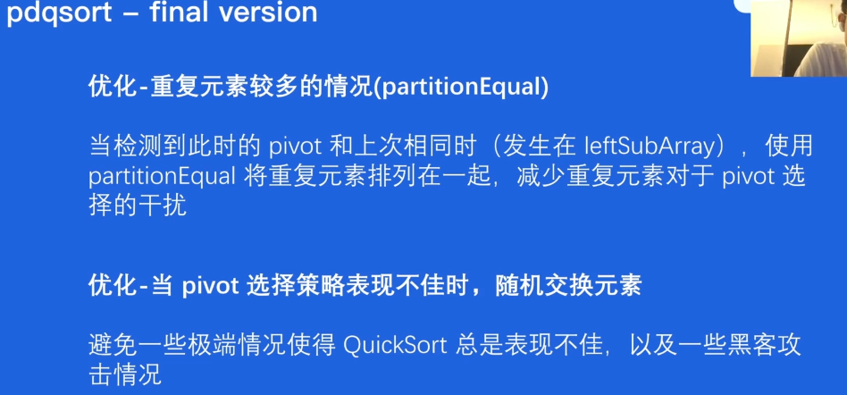

# 数据结构与算法

- 引入问题：什么是最快的排序算法？

Python-timsort

C++-introsort

Rust-pdqsort

Go(<=1.18)-introsort

- Go 语言排序算法有没有提升空间呢？

字节提出的排序算法，快10倍左右，成为**Go 1.19的默认排序算法**

## 01 问题

- Go 1.19的排序算法如何设计？
- 生产环境 vs 书本 排序算法？
- Go的排序算法是快速排序吗？

## 02 经典排序算法

### 1 插入排序

将元素不断插入已经排好序的array中

时间复杂度：

- 最好：有序时，O(n)
- 平均：O(n^2)，证明比较麻烦
- 最坏：逆序时，O(n^2)

缺点：

- 平均和最坏都是O(n^2)

优点：

- 最好情况O(n^2)

### 2 快速排序

分治思想，不断分割序列直到序列整体有序

时间复杂度：

- 最好：每次均匀一分为二，O(n*logn)
- 平均：O(n*logn)
- 最坏：每次分出一个，O(n^2)

优点：

- 平均：O(n*logn)

缺点

- 最坏：O(n^2)

### 3 堆排序

利用堆的性质

时间复杂度:

- 最好：O(n*logn)
- 最坏：O(n*logn)
- 平均：O(n*logn)

优点：

- 最坏也是O(n*logn)，稳定

缺点：

- 最好也只能是O(n*logn)

总结：

### 4 实际场景 benchmark

情况划分：

- 完全随机
- 有序/逆序
- 元素重复度较高

序列长度：

- 短序列16
- 中序列128
- 长序列1024

结果统计：

**结论**

- 所有短序列和元素有序情况下，插入排序性能最好

- 大部分情况下，快排综合性能好
- 几乎任何情况下，堆排序的表现最稳定

**形象的比喻**

- 插入排序：单车
- 快速排序：汽车
- 堆排序：地铁

### 设计一个更好的算法？

能否类比市内出行，使用多种排序算法？

## 03 从零开始打造pdqsort

还有什么场景我们没优化？

- 短序列
  - 使用插入排序 v1
- 极端情况
  - 使用堆排序保证算法的可行性v1
- 完全随机
  - 更好的pivot选择策略v2
- 有序/逆序
  - 根据序列状态翻转或者插入排序 v2
- 元素重复度较高 （mod8）？ -> ?

