# 第四节：高性能 Go 语言发行版优化与落地实践

## 概述

本节课程主要分为四个方面：

1. 自动内存管理

1. Go 内存管理及优化

1. 编译器和静态分析

1. Go 编译器优化

课前部分主要罗列课程中涉及到的概念。对于不熟悉的概念，同学们可以提前查询预习；课中部分主要罗列每一部分的关键思路，帮助同学们跟上课程的进度；课后部分是一些问题，帮助同学们在课后梳理本课程的重点。

## 课前 （必须）

### 自动内存管理

- Auto memory management: 自动内存管理

- Grabage collction: 垃圾回收

- Mutator: 业务线程

- Collector: GC 线程

- Concurrent GC: 并发 GC

- Parallel GC: 并行 GC

- Tracing garbage collection: 追踪垃圾回收
  - Copying GC: 复制对象 GC
  - Mark-sweep GC: 标记-清理 GC
  - Mark-compact GC: 标记-压缩 GC

- Reference counting: 引用计数

- Generational GC: 分代 GC
  - Young generation: 年轻代
  - Old generation: 老年代

### Go 内存管理及优化

- TCMalloc

- `mmap()` 系统调用

- scan object 和 noscan object

- mspan, mcache, mentral

- Bump-pointer object allocation: 指针碰撞风格的对象分配

### 编译器和静态分析

- 词法分析

- 语法分析

- 语义分析

- Intermediate representation (IR) 中间表示

- 代码优化

- 代码生成

- Control flow: 控制流

- Data flow: 数据流

- Intra-procedural analysis 过程内分析

- Inter-procedural analysis: 过程间分析

### Go 编译器优化

- Function inlining: 函数内联

- Escape analysis: 逃逸分析

## 课中

### 引言

- 什么是性能优化？
  - **提升软件系统处理能力**，**减少不必要的消耗**，充分发掘计算机算力

- 为什么要做性能优化？
  - 用户体验：**带来用户体验的提升** —— 让刷抖音更丝滑，让双十一购物不再卡顿
  - 资源高效利用：**降低成本，提高效率** —— 很小的优化乘以海量机器会是显著的性能提升和成本节约

- 性能优化
  - 业务层优化
    - 针对特定场景，具体问题，具体分析
    - 容易获得较大性能收益
  - 语言运行时优化
    - 解决更通用的性能问题
    - 考虑更多场景
    - Tradeoffs
  - 数据驱动
    - 自动化性能分析工具 —— pprof
    - 依靠数据而非猜测
    - 首先优化最大瓶颈

- 软件质量
  - **保证接口稳定的前提下改进实现**
    - 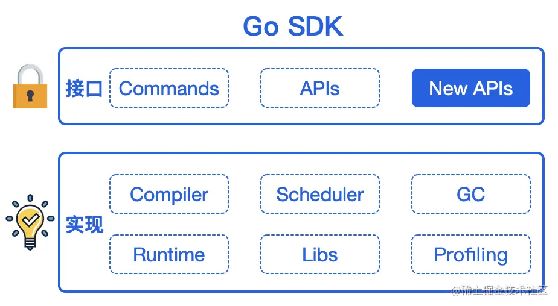
  - 测试驱动
  - 通过清晰的文档告诉用户这一项优化**做了什么**，**没做什么**，**能达到怎样的效果**
  - 隔离，优化代码用选项和原先的路径隔离，保证优化未启用时的行为同以前一致
  - 可观测、可灰度、可回滚

### 自动内存管理

#### 基本概念

- 自动内存管理：由程序语言的运行时系统管理动态内存

- 避免手动内存管理，专注于实现业务逻辑

- 保证内存使用的**正确性**和**安全性**: double-free problem, use-after-free problem

- 三个任务
  - 为新对象分配空间
  - 找到存活对象
  - 回收死亡对象的内存空间

- 概念
  - Mutator: 业务线程，分配新对象，修改对象指向关系
  - Collector: GC 线程，找到存活对象，回收死亡对象的内存空间
  - 
  - Serial GC: 只有一个 collector
  - 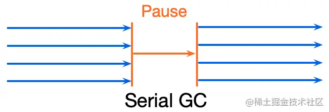
  - Parallel GC: 并行 GC，支持多个 collectors 同时回收的 GC 算法
  - 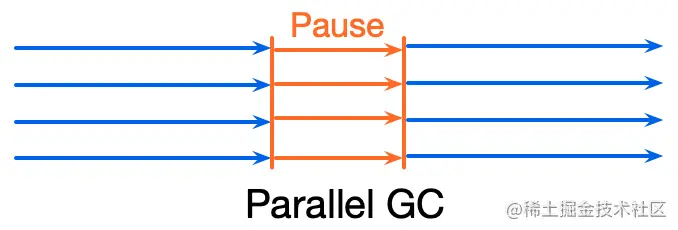
  - Concurrent GC: 并发 GC，支持 mutator(s) 和 collector(s) **同时执行**的 GC 算法
    - 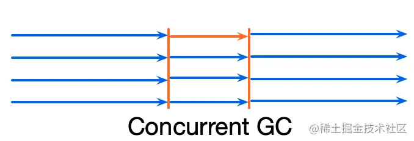
    - **Collectors 必须感知对象指向关系的改变！**
      - 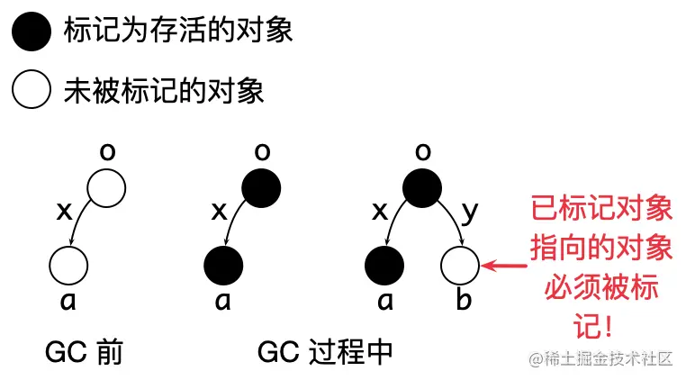

#### 追踪垃圾回收

- Tracing garbage collection: 追踪垃圾回收
  - 被回收的条件：不可达对象
  - 过程
    - 标记根对象 (GC roots): 静态变量、全局变量、常量、线程栈等
    - 标记：找到所有可达对象
    - 清理：回收所有不可达对象占据的内存空间
      - Copying GC: 将存活对象从一块内存空间复制到另外一块内存空间，原先的空间可以直接进行对象分配
      - 
      - Mark-sweep GC: 将死亡对象所在内存块标记为可分配，使用 free list 管理可分配的空间
      - 
      - Mark-compact GC: 将存活对象复制到同一块内存区域的开头
      - 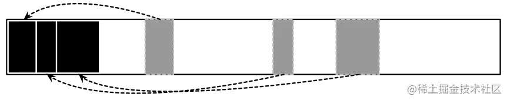

#### 引用计数

- 每个对象都有一个与之关联的引用数目

- 对象存活的条件：当且仅当引用数大于 0

- 优点
  - 内存管理的操作被**平摊到程序运行中**：指针传递的过程中进行引用计数的增减
  - 不需要了解 runtime 的细节：因为不需要标记 GC roots，因此不需要知道哪里是全局变量、线程栈等

- 缺点
  - 开销大，因为对象可能会被多线程访问，对引用计数的修改需要**原子\**\**操作**保证原子性和可见性
  - 无法回收环形数据结构
  - 每个对象都引入额外存储空间存储引用计数
  - 虽然引用计数的操作被平摊到程序运行过程中，但是回收大的数据结构依然可能引发暂停

- **说明**
  - 以上我们所讲述的技术的缺点并非是无法解决的问题。学术界和工业界在一直在致力于解决自动内存管理技术的不足之处。例如，最新的 PLDI'22 的文章 [Low-Latency, High-Throughput Garbage Collection ](https://link.juejin.cn?target=https%3A%2F%2Fusers.cecs.anu.edu.au%2F~steveb%2Fpubs%2Fpapers%2Flxr-pldi-2022.pdf)感兴趣的同学可以阅读。

### Go 内存管理及优化

#### Go 内存管理

- TCMalloc: TC is short for thread caching

- 目标：为对象在 heap 上分配内存

- 提前将**内存分块**
  - 调用系统调用 mmap() 向 OS 申请一大块内存，例如 4 MB
  - 先将内存划分成大块，例如 8 KB，称作 mspan
  - 再将大块继续划分成**特定大小**的小块，用于对象分配
  - noscan mspan: 分配不包含指针的对象 —— GC 不需要扫描
  - scan mspan: 分配包含指针的对象 —— GC 需要扫描
  - 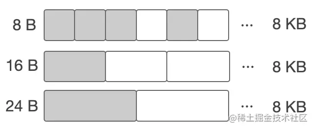

- 对象分配：根据对象的大小，选择最合适的块返回

- **内存缓存**
  - Go 内存管理构成了多级缓存机制，从 OS 分配得的内存被内存管理回收后，也不会立刻归还给 OS，而是在 Go runtime 内部先缓存起来，从而避免频繁向 OS 申请内存。内存分配的路线图如下。

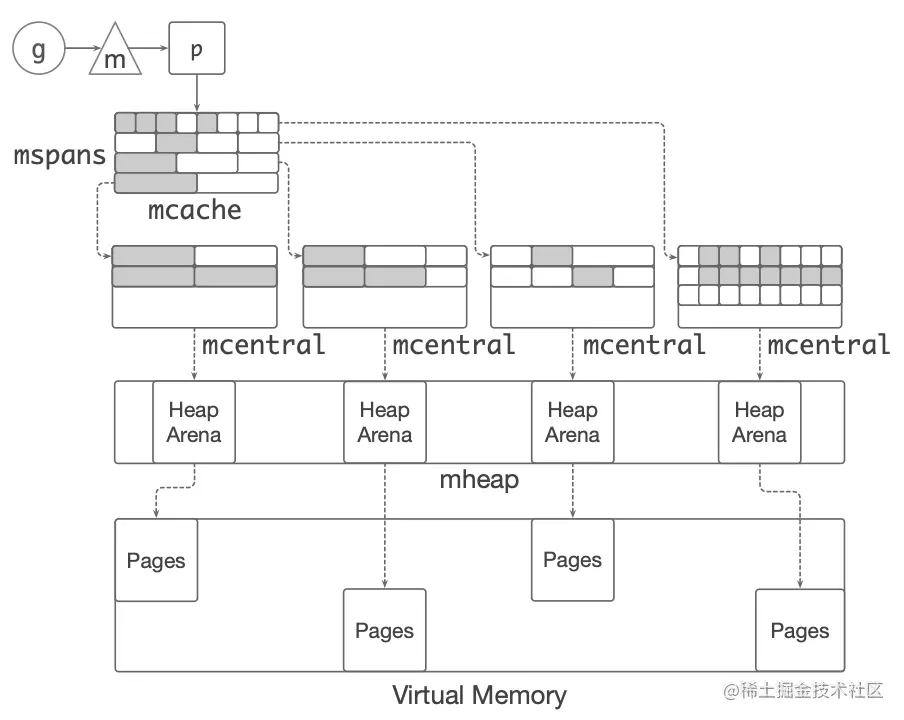

#### Go 内存管理的问题

mspan, mcache 和 mcentral 构成了内存管理的多级缓存机制。

- 对象分配是**非常高频**的操作：每秒分配 GB 级别的内存

- 线上 profiling 发现，Go 的内存分配占用很多 CPU

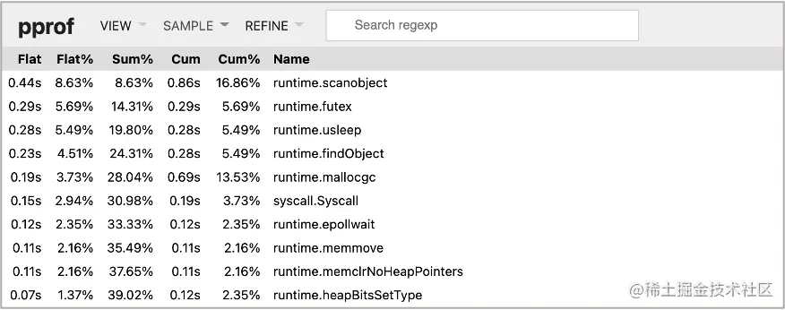

可以看到，用于分配对象的函数 `mallocgc()` 占用 CPU 较高

- 小对象分配占大多数

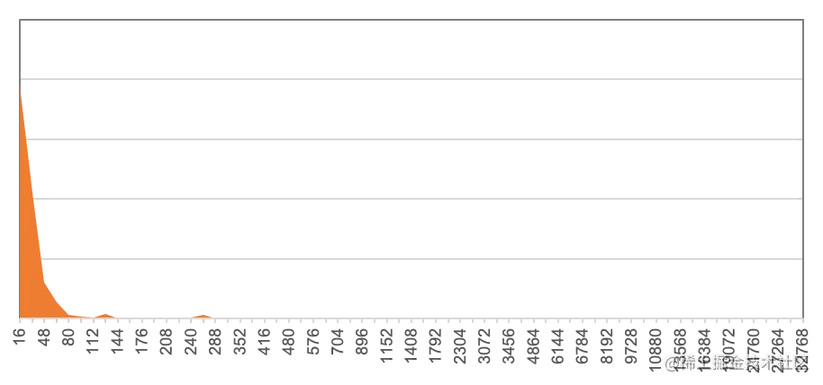

横轴是对象大小，纵轴是数目，可以看到绝大多数对象都小于 80 B。因此**优化小对象分配是关键**。

#### 字节跳动的优化方案

- **Balanced GC**

- 核心：将 noscan 对象在 per-g allocation buffer (GAB) 上分配，并使用移动对象 GC 管理这部分内存，提高对象分配和回收效率

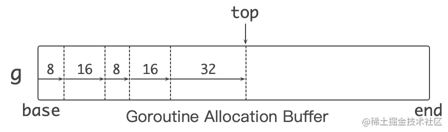

- 每个 g 会附加一个较大的 allocation buffer (例如 1 KB) 用来分配小于 128 B 的 noscan 小对象

- bump pointer 风格的对象分配。示意如下。

```
if g.ab.end - g.ab.top < size {
    // Allocate a new allocation buffer
}
addr := g.ab.top
g.ab.top += size
return addr
复制代码
```

- 分配对象时，根据对象大小移动 `top` 指针并返回，快速完成一次对象分配

- 同原先调用 `mallocgc()` 进行对象分配的方式相比，balanced GC 缩短了对象分配的路径，减少了对象分配执行的指令数目，降低 CPU 使用

从 Go runtime 内存管理模块的角度看，一个 allocation buffer 其实是一个大对象。本质上 balanced GC 是**将多次小对象的分配合并成一次大对象的分配**。因此，当 GAB 中哪怕只有一个小对象存活时，Go runtime 也会认为整个大对象（即 GAB）存活。为此，balanced GC 会根据 GC 策略，**将 GAB 中存活的对象移动到另外的 GAB 中**，从而压缩并清理 GAB 的内存空间，原先的 GAB 空间由于不再有存活对象，可以全部释放，如下图所示。

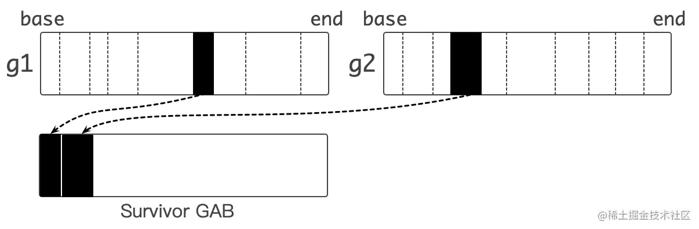

上图上方是两个 GAB，其中虚线表示 GAB 中对象的分界线。黑色表示 GAB 中存活的对象，白色表示死掉的对象。由于 GAB 中有存活对象，整个 GAB 无法被回收。

Balanced GC 会将 GAB 中存活的对象移动到下面的 GAB 中，这样原先的两个 GABs 就可以被释放，压缩并清理 GAB 的内存空间。

Balanced GC 只负责 noscan 对象的分配和移动，对象的标记和回收依然依赖 Go GC 本身，并和 Go GC 保持兼容。

### 编译器和静态分析

- 编译器的结构

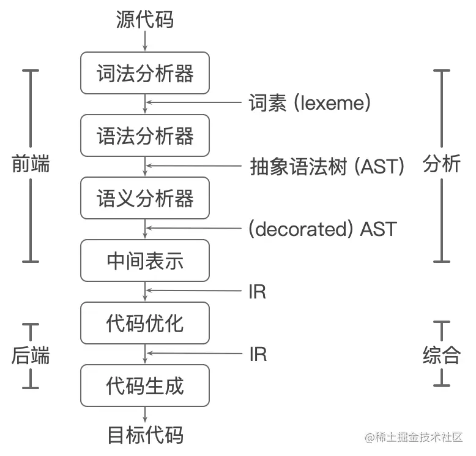

- 静态分析：**不执行代码**，推导程序的行为，分析程序的性质。

- 控制流：程序的执行流程

- 数据流：数据在控制流上的传递

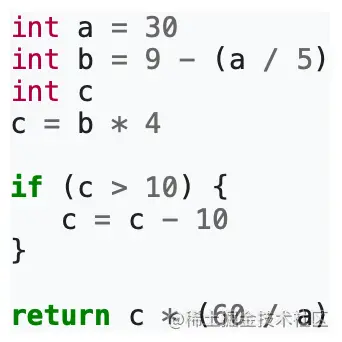

上图的程序转换成控制流图 (control-flow graph)

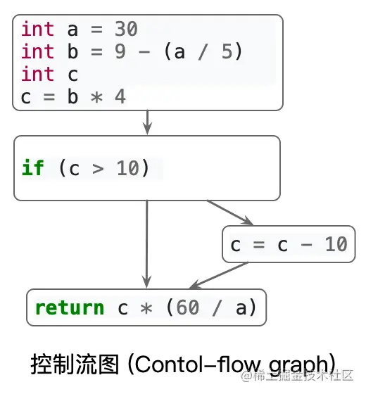

- 通过分析控制流和数据流，我们可以知道**更多关于程序的性质(properties)** ，这些事实可以帮助我们做编译优化。
  - 例如上面的程序。我们通过分析数据流和控制流，知道这个程序始终返回 4。编译器可以根据这个结果做出优化。

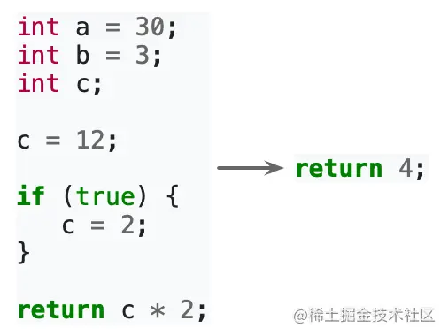

- Intra-procedural analysis: 函数内分析：在函数内进行控制流和数据流的分析

- Inter-procedural analysis: 函数间分析：除了函数内的分析，还需要考虑跨函数的数据流和控制流，例如参数传递，函数返回值等

### Go 编译器优化

#### 目的

- 用户无感知，重新编译即可获得性能收益

- 通用的优化手段

#### 现状

- 采用的优化较少

- 追求编译时间短，因此没有进行复杂的代码分析和优化

#### 思路

- 面向后端长期执行的任务

- 用适当增加编译时间换取更高性能的代码

#### 函数内联

- 定义：将被调用函数的函数体的副本替换到调用位置上，同时重写代码以反映参数的绑定

- 优点
  - 消除调用开销
  - 将过程间分析的问题转换为过程内分析，帮助其他分析

- 缺点
  - 函数体变大
  - 编译生成的 Go 镜像文件变大

- 函数内联在大多数情况下是正向优化，即多内联，会提升性能

- 采取一定的策略决定是否内联
  - 调用和被调用函数的规模

- Go 内联的限制
  - 语言特性：interface, defer 等等，限制了内联优化
  - 内联策略非常保守

- 字节跳动的优化方案
  - 修改了内联策略，让更多函数被内联
  - 增加了其他优化的机会：逃逸分析

- 开销
  - Go 镜像大小略有增加
  - 编译时间增加
  - 运行时栈扩展开销增加

#### 逃逸分析

- 定义：分析代码中指针的动态作用域，即指针在何处可以被访问

- 大致思路
  - 从对象分配处出发，沿着控制流，观察数据流。若发现指针 p 在当前作用域 s:
    - 作为参数传递给其他函数；
    - 传递给全局变量；
    - 传递给其他的 goroutine;
    - 传递给已逃逸的指针指向的对象；
  - 则指针 p 逃逸出 s，反之则没有逃逸出 s.

- **优化：未逃逸出当前函数的指针指向的对象可以在栈上分配**
  - 对象在栈上分配和回收很快：移动 sp 即可完成内存的分配和回收；
  - 减少在堆上分配对象，降低 GC 负担。

## 课后

1. 从业务层和语言运行时层进行优化分别有什么特点？

1. 从软件工程的角度出发，为了保证语言 SDK 的可维护性和可拓展性，在进行运行时优化时需要注意什么？

1. 自动内存管理技术从大类上分为哪两种，每一种技术的特点以及优缺点有哪些？

1. 什么是分代假说？分代 GC 的初衷是为了解决什么样的问题？

1. Go 是如何管理和组织内存的？

1. 为什么采用 bump-pointer 的方式分配内存会很快？

1. 为什么我们需要在编译器优化中进行静态代码分析？

1. 函数内联是什么，这项优化的优缺点是什么？

1. 什么是逃逸分析？逃逸分析是如何提升代码性能的？

## 参考文献

1. The Garbage Collection Handbook -- the art of automatic memory management

是自动内存管理领域的集大成之作。把自动内存管理的问题、动机、方案、以及最新研究进展和方向进行了非常详尽的阐述。整个书很好读，参考文献非常充实，推荐大家阅读英文版。

1. JEP 333: ZGC: A Scalable Low-Latency Garbage Collector [openjdk.java.net/jeps/333](https://link.juejin.cn?target=https%3A%2F%2Fopenjdk.java.net%2Fjeps%2F333)

是目前 HotSpot JVM 上 pauseless GC 实现的 proposal，可以看作 GC 领域比较新的工程方面的进展。

1. 数据密集型应用系统设计 Designing Data-Intensive Applications: The Big Ideas Behind Reliable, Scalable, and Maintainable Systems

通过例子带大家理解互联网产品需要解决的问题以及方案。

1. 编译原理 The Dragon book, Compilers: Principles, Techniques, and Tools

在编译器前端着墨较多。本书第二版的第九章 **机器无关优化**，推荐大家反复仔细阅读。这一章主要讲述的是编译优化中常见的数据流分析问题，建议大家跟随书本仔细推导书中的例子，会帮助你对数据流分析有个大致的认识。这一章给出的引用文献大多是编译和静态分析领域非常有影响力的论文，有兴趣的同学可以阅读。

1. 编译原理 Principles and Techniques of Compilers [silverbullettt.bitbucket.io/courses/com…](https://link.juejin.cn?target=https%3A%2F%2Fsilverbullettt.bitbucket.io%2Fcourses%2Fcompiler-2022%2Findex.html)

南京大学编译原理课程。

1. 静态程序分析 Static Program Analysis [pascal-group.bitbucket.io/teaching.ht…](https://link.juejin.cn?target=https%3A%2F%2Fpascal-group.bitbucket.io%2Fteaching.html)

南京大学静态程序分析课程。参考文献 4 数据流分析读不懂的地方可以参考本课程的课件。

1. 编译器设计 Engineering a Compiler

在编译器后端优化着墨较多。可以帮助大家理解后端优化的问题。

1. JVM Anatomy Quark #4: TLAB allocation [shipilev.net/jvm/anatomy…](https://link.juejin.cn?target=https%3A%2F%2Fshipilev.net%2Fjvm%2Fanatomy-quarks%2F4-tlab-allocation%2F)

Goroutine allocation buffer (GAB) 的优化思路在 HotSopt JVM 也能找到类似的实现。

1. Constant folding, [en.wikipedia.org/wiki/Consta…](https://link.juejin.cn?target=https%3A%2F%2Fen.wikipedia.org%2Fwiki%2FConstant_folding)

常量折叠数据流分析。

1. Choi, Jong-Deok, et al. "Escape analysis for Java." *Acm Sigplan* *Notices* 34.10 (1999): 1-19.

逃逸分析的 Java 实现。

1. Zhao, Wenyu, Stephen M. Blackburn, and Kathryn S. McKinley. "Low-Latency, High-Throughput Garbage Collection." (PLDI 2022). 学术界和工业界在一直在致力于解决自动内存管理技术的不足之处，感兴趣的同学可以阅读。

# 第五节：设计模式之 Database/SQL 与 GORM 实践

## 概述

本课程目标为带领同学们了解 Go 的 Database/SQL的实现，了解 GORM 的实现原理、使用简单，以及如何基于 GORM 做一些定制化开发。

课程结构为:

- 理解 database/sql

- GORM 使用简介

- GORM 设计原理

- GORM 最佳实践

## 课前知识 （必须）

课前内容主要带领大家了解一些基础概念

- 知道什么是数据库、什么是 SQL
  - [zhuanlan.zhihu.com/p/41576768](https://link.juejin.cn?target=https%3A%2F%2Fzhuanlan.zhihu.com%2Fp%2F41576768)

- 知道如何使用 database/sql 建立连接、使用
  - [github.com/go-sql-driv…](https://link.juejin.cn?target=https%3A%2F%2Fgithub.com%2Fgo-sql-driver%2Fmysql)

- 了解 DSN 是什么
  - [github.com/go-sql-driv…](https://link.juejin.cn?target=https%3A%2F%2Fgithub.com%2Fgo-sql-driver%2Fmysql%23dsn-data-source-name)
  - [en.wikipedia.org/wiki/Data_s…](https://link.juejin.cn?target=https%3A%2F%2Fen.wikipedia.org%2Fwiki%2FData_source_name)

- 对 GORM 有个简单的认知
  - [gorm.io/docs/index.…](https://link.juejin.cn?target=https%3A%2F%2Fgorm.io%2Fdocs%2Findex.html)

## 课中

课中课程的结构主要分为如下部分：

- 理解 Database/SQL
  - Database/SQL 的基本用法
  - 设计原理
  - 基础概念

- GORM 的使用简介
  - GORM 的基本用法
  - Model 定义
  - 惯例约定
  - 关联介绍

- GORM 的设计原理
  - SQL 生成的机制
  - 插件扩展机制
  - ConnPool 扩展机制
  - Dialector 扩展机制

- GORM 最佳实践
  - GORM 最佳时间
  - 定制企业级开发

- FAQ & 工程成长

## 课后作业

> 欢迎大家积极挑战，答案解析在本节课程直播完成后提供。

1. 给某个数据库实现 driver (tidb, 国产数据库...)，通过 docker compose 搭建测试环境，并实现测试 CRUD

1. 使用 GORM 的插件机制完成加密字段，支持从 ctx 中读取不同租户的密钥加密，通过 docker compose 搭建测试环境，并完成相就加解密存入、取出数据库进行测试

# 第六节：实战项目 - Go 语言笔记服务

## 一、课程背景与目标

### 课程背景

在大家已经学完前 5节 Go 原理与实践课程的基础上，通过项目实战帮助大家把前面学过的知识应用起来

### 课程目标

- 将前面所学的知识应用到项目中

- 熟悉项目的代码,可以将项目正常运行

- 熟悉 Kitex/Gorm 的使用

## 二、课前了解

### 安装 Docker/Postman/Git

- 安装 Minikube 或 Docker Desktop [安装教程](https://link.juejin.cn?target=https%3A%2F%2Fwww.runoob.com%2Fdocker%2Fwindows-docker-install.html)

- 可以使用 Minikube 或者使用 Docker Desktop 启动 Docker

- 安装 Postman

- 安装 Git [安装教程](https://link.juejin.cn?target=https%3A%2F%2Fwww.liaoxuefeng.com%2Fwiki%2F896043488029600%2F896067074338496)

### Kitex 初体验

通过阅读 [www.cloudwego.io/zh/docs/kit…](https://link.juejin.cn?target=https%3A%2F%2Fwww.cloudwego.io%2Fzh%2Fdocs%2Fkitex%2Fgetting-started%2F) 尝试运行 Kitex 的示例代码

- kitex 暂时没有针对 Windows 做支持，如果本地开发环境是 Windows 建议使用 [WSL2](https://link.juejin.cn?target=https%3A%2F%2Fdocs.microsoft.com%2Fzh-cn%2Fwindows%2Fwsl%2Finstall)

### Gorm 初体验

通过阅读 [gorm.cn/docs/#Insta…](https://link.juejin.cn?target=https%3A%2F%2Fgorm.cn%2Fdocs%2F%23Install) 尝试运行 Gorm 的示例代码

### 了解 Etcd和Opentracing

了解 etcd 是什么以及 opentracing 是什么

## 三、项目介绍

### 项目简介

EasyNote 提供了一套比较完整的笔记后端API服务.

- 项目地址 [github.com/cloudwego/k…](https://link.juejin.cn?target=https%3A%2F%2Fgithub.com%2Fcloudwego%2Fkitex-examples%2Ftree%2Fmain%2Fbizdemo%2Feasy_note)
- 推荐版本 Golang >= 1.15

### 项目模块介绍

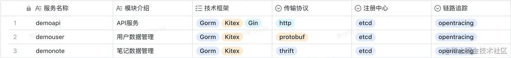

### 项目服务调用关系

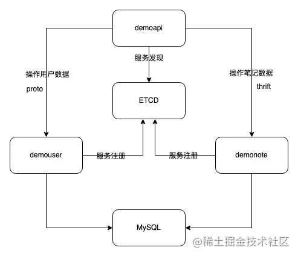

### 项目模块功能介绍

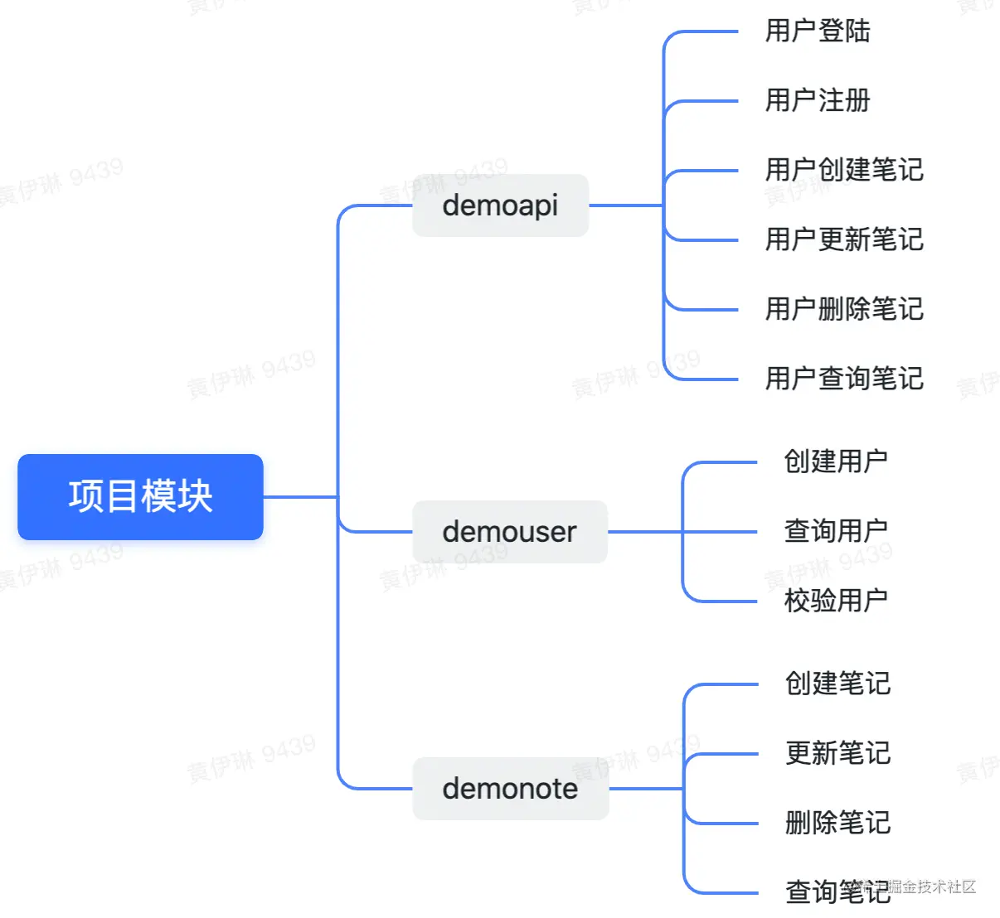

### 项目技术栈

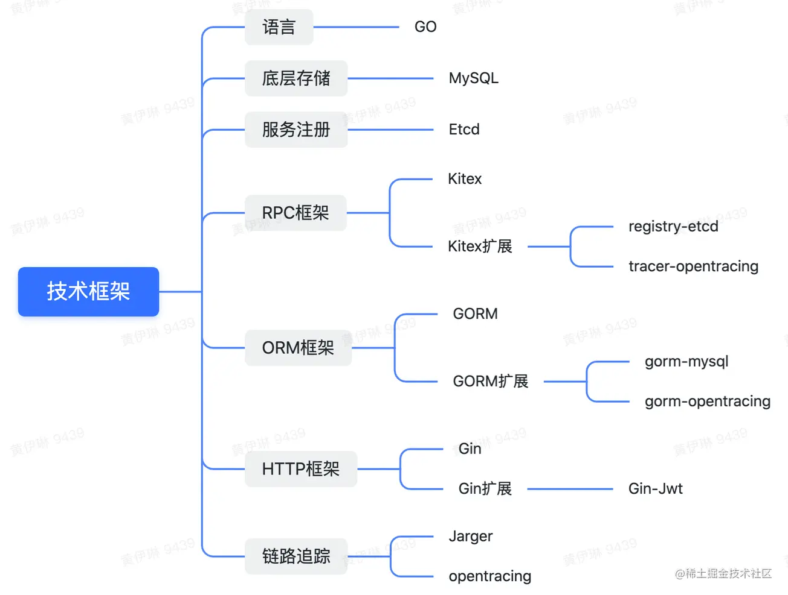

### 项目相关的使用框架资料

|                       |                                                              | 框架文档地址                                                 | github地址                                                   | 拓展文档 |
| --------------------- | ------------------------------------------------------------ | ------------------------------------------------------------ | ------------------------------------------------------------ | -------- |
| RPC框架Kitex          | 框架文档                                                     | [www.cloudwego.io/zh/docs/kit…](https://link.juejin.cn?target=https%3A%2F%2Fwww.cloudwego.io%2Fzh%2Fdocs%2Fkitex%2Foverview%2F) | [github.com/cloudwego/k…](https://link.juejin.cn?target=https%3A%2F%2Fgithub.com%2Fcloudwego%2Fkitex) |          |
| Kitex-etcd扩展        | [github.com/kitex-contr…](https://link.juejin.cn?target=https%3A%2F%2Fgithub.com%2Fkitex-contrib%2Fregistry-etcd) | [github.com/kitex-contr…](https://link.juejin.cn?target=https%3A%2F%2Fgithub.com%2Fkitex-contrib%2Fregistry-etcd) | [www.cloudwego.io/zh/docs/kit…](https://link.juejin.cn?target=https%3A%2F%2Fwww.cloudwego.io%2Fzh%2Fdocs%2Fkitex%2Ftutorials%2Fframework-exten%2Fregistry%2F)[www.cloudwego.io/zh/docs/kit…](https://link.juejin.cn?target=https%3A%2F%2Fwww.cloudwego.io%2Fzh%2Fdocs%2Fkitex%2Ftutorials%2Fframework-exten%2Fservice_discovery%2F) |          |
| Kitex-OpenTracing扩展 | [www.cloudwego.io/zh/docs/kit…](https://link.juejin.cn?target=https%3A%2F%2Fwww.cloudwego.io%2Fzh%2Fdocs%2Fkitex%2Ftutorials%2Fservice-governance%2Ftracing%2F) | [github.com/kitex-contr…](https://link.juejin.cn?target=https%3A%2F%2Fgithub.com%2Fkitex-contrib%2Ftracer-opentracing) | [www.cloudwego.io/zh/docs/kit…](https://link.juejin.cn?target=https%3A%2F%2Fwww.cloudwego.io%2Fzh%2Fdocs%2Fkitex%2Ftutorials%2Fframework-exten%2Fmiddleware%2F) |          |
| ORM框架Gorm           | 框架                                                         | [gorm.cn/zh_CN/](https://link.juejin.cn?target=https%3A%2F%2Fgorm.cn%2Fzh_CN%2F) | [github.com/go-gorm/gor…](https://link.juejin.cn?target=https%3A%2F%2Fgithub.com%2Fgo-gorm%2Fgorm) |          |
| Gorm-Opentracing扩展  | [github.com/go-gorm/ope…](https://link.juejin.cn?target=https%3A%2F%2Fgithub.com%2Fgo-gorm%2Fopentracing) | [github.com/go-gorm/ope…](https://link.juejin.cn?target=https%3A%2F%2Fgithub.com%2Fgo-gorm%2Fopentracing) | [gorm.cn/zh_CN/docs/…](https://link.juejin.cn?target=https%3A%2F%2Fgorm.cn%2Fzh_CN%2Fdocs%2Fwrite_plugins.html) |          |
| HTTP框架Gin           | 框架                                                         | [github.com/gin-gonic/g…](https://link.juejin.cn?target=https%3A%2F%2Fgithub.com%2Fgin-gonic%2Fgin%23gin-web-framework) | [github.com/gin-gonic/g…](https://link.juejin.cn?target=https%3A%2F%2Fgithub.com%2Fgin-gonic%2Fgin) |          |
| Gin-JWT扩展           | [github.com/appleboy/gi…](https://link.juejin.cn?target=https%3A%2F%2Fgithub.com%2Fappleboy%2Fgin-jwt%23usage) | [github.com/appleboy/gi…](https://link.juejin.cn?target=https%3A%2F%2Fgithub.com%2Fappleboy%2Fgin-jwt) |                                                              |          |

## 四、项目代码介绍

### 项目代码目录结构介绍

| [idl](https://link.juejin.cn?target=https%3A%2F%2Fgithub.com%2Fcloudwego%2Fkitex-examples%2Ftree%2Fmain%2Fbizdemo%2Feasy_note%2Fidl) | [thrift](https://link.juejin.cn?target=https%3A%2F%2Fgithub.com%2Fcloudwego%2Fkitex-examples%2Fblob%2Fmain%2Fbizdemo%2Feasy_note%2Fidl%2Fnote.thrift) / [proto](https://link.juejin.cn?target=https%3A%2F%2Fgithub.com%2Fcloudwego%2Fkitex-examples%2Fblob%2Fmain%2Fbizdemo%2Feasy_note%2Fidl%2Fuser.proto) 接口定义文件 |                                                              | 文档/子目录介绍                                              |
| ------------------------------------------------------------ | ------------------------------------------------------------ | ------------------------------------------------------------ | ------------------------------------------------------------ |
| [kitex_gen](https://link.juejin.cn?target=https%3A%2F%2Fgithub.com%2Fcloudwego%2Fkitex-examples%2Ftree%2Fmain%2Fbizdemo%2Feasy_note%2Fkitex_gen) | Kitex自动生成的代码                                          |                                                              |                                                              |
| [pkg](https://link.juejin.cn?target=https%3A%2F%2Fgithub.com%2Fcloudwego%2Fkitex-examples%2Ftree%2Fmain%2Fbizdemo%2Feasy_note%2Fpkg) | [constants](https://link.juejin.cn?target=https%3A%2F%2Fgithub.com%2Fcloudwego%2Fkitex-examples%2Ftree%2Fmain%2Fbizdemo%2Feasy_note%2Fpkg%2Fconstants) | 常量                                                         |                                                              |
| [errno](https://link.juejin.cn?target=https%3A%2F%2Fgithub.com%2Fcloudwego%2Fkitex-examples%2Ftree%2Fmain%2Fbizdemo%2Feasy_note%2Fpkg%2Ferrno) | 错误码                                                       | [关于错误码的讨论](https://link.juejin.cn?target=https%3A%2F%2Fgithub.com%2Fcloudwego%2Fkitex%2Fdiscussions%2F248) |                                                              |
| [middleware](https://link.juejin.cn?target=https%3A%2F%2Fgithub.com%2Fcloudwego%2Fkitex-examples%2Ftree%2Fmain%2Fbizdemo%2Feasy_note%2Fpkg%2Fmiddleware) | Kitex的中间件                                                | [Kitex Middleware 扩展](https://link.juejin.cn?target=https%3A%2F%2Fwww.cloudwego.io%2Fzh%2Fdocs%2Fkitex%2Ftutorials%2Fframework-exten%2Fmiddleware%2F) |                                                              |
| [bound](https://link.juejin.cn?target=https%3A%2F%2Fgithub.com%2Fcloudwego%2Fkitex-examples%2Ftree%2Fmain%2Fbizdemo%2Feasy_note%2Fpkg%2Fbound) | Kitex Transport Pipeline-Bound 扩展                          | [什么是Kitex的Transport Pipeline-Bound 扩展](https://link.juejin.cn?target=https%3A%2F%2Fwww.cloudwego.io%2Fzh%2Fdocs%2Fkitex%2Ftutorials%2Fframework-exten%2Ftrans_pipeline%2F) |                                                              |
| [tracer](https://link.juejin.cn?target=https%3A%2F%2Fgithub.com%2Fcloudwego%2Fkitex-examples%2Ftree%2Fmain%2Fbizdemo%2Feasy_note%2Fpkg%2Ftracer) | Jarger 初始化                                                |                                                              |                                                              |
| [cmd](https://link.juejin.cn?target=https%3A%2F%2Fgithub.com%2Fcloudwego%2Fkitex-examples%2Ftree%2Fmain%2Fbizdemo%2Feasy_note%2Fcmd) | [api](https://link.juejin.cn?target=https%3A%2F%2Fgithub.com%2Fcloudwego%2Fkitex-examples%2Ftree%2Fmain%2Fbizdemo%2Feasy_note%2Fcmd%2Fapi) | demoapi服务的业务代码                                        | handlers : 封装了 api 的业务逻辑rpc : 封装了调用其它 rpc 服务的逻辑 |
| [note](https://link.juejin.cn?target=https%3A%2F%2Fgithub.com%2Fcloudwego%2Fkitex-examples%2Ftree%2Fmain%2Fbizdemo%2Feasy_note%2Fcmd%2Fnote) | demonote服务的业务代码                                       | dal : 封装了数据库的访问逻辑service: 封装了业务逻辑rpc : 封装了调用其它 rpc 服务的逻辑pack : 数据打包/处理 |                                                              |
| [user](https://link.juejin.cn?target=https%3A%2F%2Fgithub.com%2Fcloudwego%2Fkitex-examples%2Ftree%2Fmain%2Fbizdemo%2Feasy_note%2Fcmd%2Fuser) | demouser服务的业务代码                                       |                                                              |                                                              |

### 项目运行

#### 运行基础依赖

```
docker-compose up
复制代码
```

执行上述命令启动 MySQL、Etcd、Jaeger 的 docker 镜像

#### 运行 demonote 服务

```
cd cmd/note 
sh build.sh 
sh output/bootstrap.sh
复制代码
```

#### 运行 demouser 服务

```
cd cmd/user 
sh build.sh 
sh output/bootstrap.sh
复制代码
```

#### 运行 demoapi 服务

```
cd cmd/api 
chmod +x run.sh 
./run.sh
复制代码
```

## 参考文档

- [www.cloudwego.io/zh/docs/kit…](https://link.juejin.cn?target=https%3A%2F%2Fwww.cloudwego.io%2Fzh%2Fdocs%2Fkitex%2F)

- [github.com/kitex-contr…](https://link.juejin.cn?target=https%3A%2F%2Fgithub.com%2Fkitex-contrib%2Fregistry-etcd)

- [github.com/kitex-contr…](https://link.juejin.cn?target=https%3A%2F%2Fgithub.com%2Fkitex-contrib%2Ftracer-opentracing)

- [github.com/cloudwego/k…](https://link.juejin.cn?target=https%3A%2F%2Fgithub.com%2Fcloudwego%2Fkitex)

- [gorm.io/docs/index.…](https://link.juejin.cn?target=https%3A%2F%2Fgorm.io%2Fdocs%2Findex.html)

- [github.com/go-gorm/gor…](https://link.juejin.cn?target=https%3A%2F%2Fgithub.com%2Fgo-gorm%2Fgorm)

- [github.com/go-gorm/ope…](https://link.juejin.cn?target=https%3A%2F%2Fgithub.com%2Fgo-gorm%2Fopentracing)

- [github.com/gin-gonic/g…](https://link.juejin.cn?target=https%3A%2F%2Fgithub.com%2Fgin-gonic%2Fgin)

- [github.com/appleboy/gi…](https://link.juejin.cn?target=https%3A%2F%2Fgithub.com%2Fappleboy%2Fgin-jwt)


作者：青训营官方账号
链接：https://juejin.cn/post/7095977466094682148/
来源：稀土掘金
著作权归作者所有。商业转载请联系作者获得授权，非商业转载请注明出处。