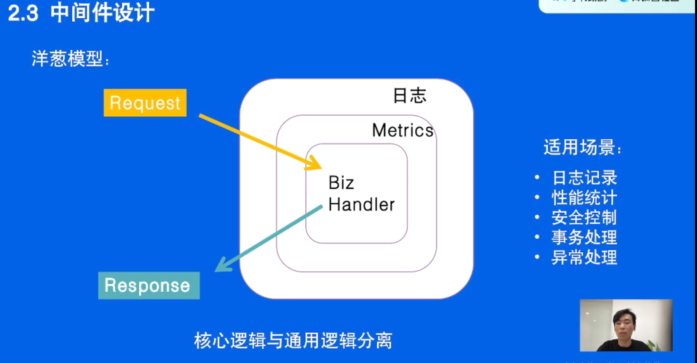
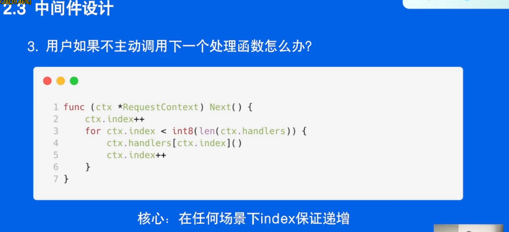
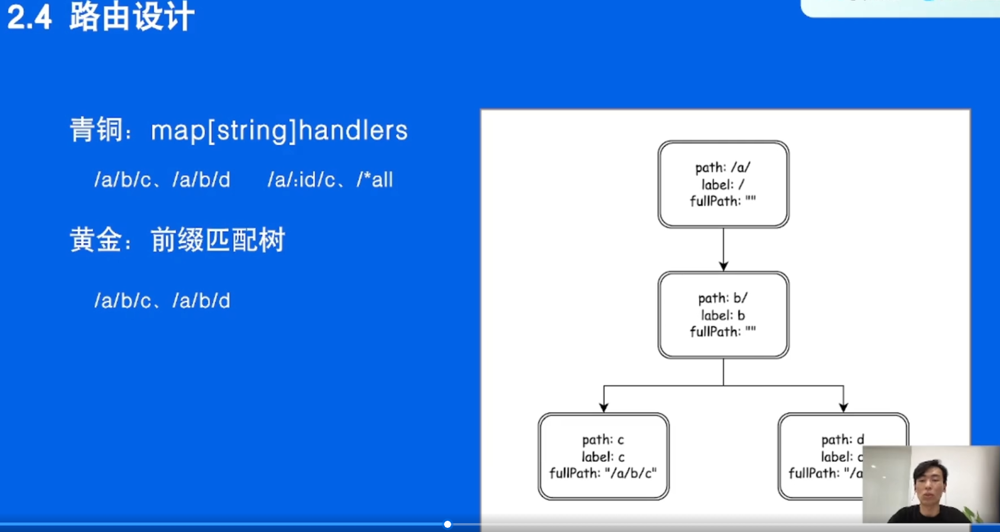
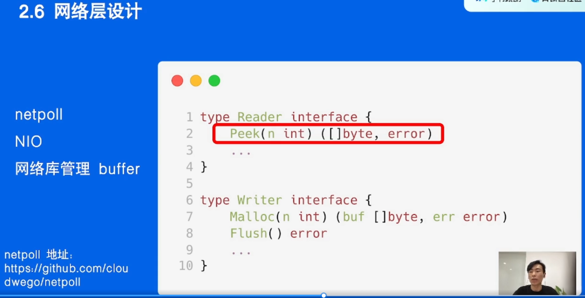
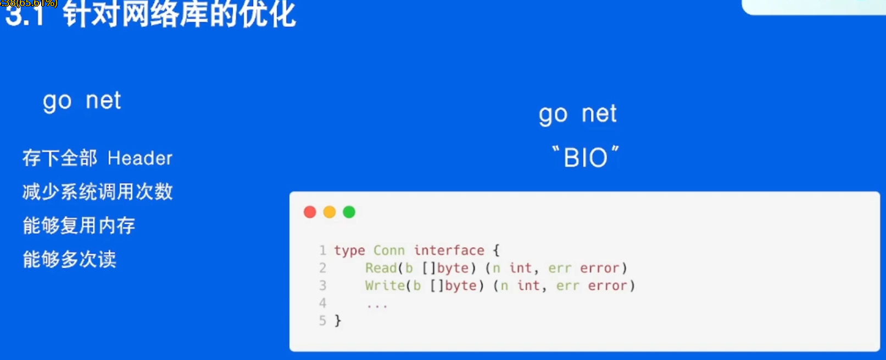

# 第十四节：HTTP 框架修炼之道

## 概述

本节课程主要分为四个方面：

1. HTTP 协议相关知识

1. HTTP 框架的设计与实现

1. HTTP 框架的优化手段

1. 企业实践

课前部分主要罗列课程中涉及到的概念。对于不熟悉的概念，同学们可以提前查询预习；课后部分是一些问题，帮助同学们在课后梳理本课程的重点。

## 课前

### HTTP 协议

- HTTP 协议出现背景

- HTTP 协议是什么

- HTTP 协议有什么

可参考[百度百科](https://link.juejin.cn?target=https%3A%2F%2Fbaike.baidu.com%2Fitem%2FHTTP%2F243074%3Ffr%3Daladdin)

### 尝试写一个 hello world 服务器

可尝试用 [gin](https://link.juejin.cn?target=https%3A%2F%2Fgithub.com%2Fgin-gonic%2Fgin) 写一个 hello world 程序，达到以下效果


### HTTP 框架中常见概念

- 框架路由：根据请求的 URI 选择对应的处理函数。

  - 首先匹配 HTTP 方法

  - 静态路由: 精确匹配注册的路由，如：/a/b/c、/a/b/d

  - 参数路由:

    - 命名参数：形如 **`:name`**这类叫做命名参数，命名参数只匹配单个路径段：

    - ```
      Pattern: /user/:user
      
       /user/gordon              match(user = gordon)
       /user/you                 match(user = you)
       /user/gordon/profile      no match
       /user/                    no match
      复制代码
      ```

    - 通配参数：形如 **`*action`**这类叫做通配参数，就像名字所暗示的那样，它们匹配所有内容。因此，它们必须始终位于模式的末尾：

    - ```
      Pattern: /src/*filepath
      
       /src/                     match(filepath = "")
       /src/somefile.go          match(filepath = somefile.go)
       /src/subdir/somefile.go   match(filepath = subdie/somefile.go)
      复制代码
      ```

  - 路由修复: 如果只注册了 /a/b，但是访问的 URI 是 /a/b/，那可以提供自动重定向到 /a/b 能力；同样，如果只注册了 /a/b/，但是访问的 URI 是 /a/b，那可以提供自动重定向到 /a/b/ 能力

  - 冲突路由：同时注册 /a/b 和 /:id/b，并设定优先级。比如：当请求 URI 为 /a/b 时，优先匹配静态路由 /a/b

- 什么是框架中间件，可参考 [gin](https://link.juejin.cn?target=https%3A%2F%2Fgithub.com%2Fgin-gonic%2Fgin%23using-middleware)，[kratos](https://link.juejin.cn?target=https%3A%2F%2Fgo-kratos.dev%2Fdocs%2Fcomponent%2Fmiddleware%2Foverview%2F)

### Golang

- [sync.Pool](https://link.juejin.cn?target=https%3A%2F%2Fpkg.go.dev%2Fsync%23Pool) 用法

### 网络库

- C10K Problem

- Select，Poll，Epoll

- Epoll ET、LT 区别

- 字节跳动自研网络库 [netpoll](https://link.juejin.cn?target=https%3A%2F%2Fgithub.com%2Fcloudwego%2Fnetpoll)，[netpoll-examples](https://link.juejin.cn?target=https%3A%2F%2Fgithub.com%2Fcloudwego%2Fnetpoll-examples)

### SIMD

- SIMD 是什么，可参考[维基百科](https://link.juejin.cn?target=https%3A%2F%2Fen.wikipedia.org%2Fwiki%2FSingle_instruction%2C_multiple_data)

- [Improving performance with SIMD intrinsics in three use cases](https://link.juejin.cn?target=https%3A%2F%2Fstackoverflow.blog%2F2020%2F07%2F08%2Fimproving-performance-with-simd-intrinsics-in-three-use-cases%2F)

## 课后作业

1. 为什么 HTTP 框架做要分层设计？分层设计有哪些优势与劣势。

1. 现有开源社区 HTTP 框架有哪些优势与不足。

1. 中间件还有没有其他实现方式？可以用伪代码说明。

1. 完成基于前缀路由树的注册与查找功能？可以用伪代码说明。

1. 路由还有没有其他的实现方式？

作者：青训营官方账号
链接：https://juejin.cn/post/7099665398655615006/
来源：稀土掘金
著作权归作者所有。商业转载请联系作者获得授权，非商业转载请注明出处。

### 课后作业-重点内容 Review

**作业要求：**

1. 为什么 HTTP 框架做要分层设计？分层设计有哪些优势与劣势。

1. 现有开源社区 HTTP 框架有哪些优势与不足。

1. 中间件还有没有其他实现方式？可以用伪代码说明。

1. 完成基于前缀路由树的注册与查找功能？可以用伪代码说明。

1. 路由还有没有其他的实现方式？

   < 作业提交截止时间：5月24日 10:00前 >

### **正确答案：**

该问题为开放性问题，答案合理即可。

1. 优势：
   1. 分层设计可以提高框架的扩展性、可维护性、复用性
   2. 分层设计可以让相关同学聚焦在核心层上而不用关心其他层的实现
   3.  劣势：
   4. 提高代码设计的复杂性，设计不好可能会导致循环依赖
   5. 由于使用接口进行解耦，可能会对代码性能造成影响

1. gin：易用性强；生态丰富，但扩展性一般，性能一般。
   1.  fasthttp：性能强；扩展性一般，生态一般。
   2.  go-zero：开箱即用，提供全套微服务能力，但扩展性一般，性能一般。

1. 课程中讲的中间件模型需要有一个地方保存 index，对于没有 index 的场景，可以将中间件构造为递归函数进行调用。

```
// Endpoint represent one method for calling from remote.
type Endpoint func ( ctx context.Context, req, resp interface {})  ( err error )

// Middleware deal with input Endpoint and output Endpoint.
type Middleware func ( Endpoint ) Endpoint

// Chain connect middlewares into one middleware.
func chain ( mws ...Middleware ) Middleware {
return func ( next Endpoint ) Endpoint {
for i := len ( mws ) - 1; i >= 0; i-- {
next = mws [ i ]( next )
}
return next
   }
} 
复制代码
```

1. 伪代码如下，可以使用递归实现，也可以使用其他更高性能的实现，这里提供递归的实现方式。

```
func ( r *router ) addRoute ( path string, h app.HandlersChain ) {
// 检查 path 合理性
   checkPathValid ( path )
// 循环添加 path 中的每一段
   for i range len ( path ) {
// 处理 : 类型参数路由
      if path [ i ] == ":" {
// 添加 : 之前的静态路由
         Insert ( path [ :i ] , staticKind, nil )
// 处理参数名称
         paramNames.add ( paramName )
// 判断当前是否是路由 path 的最后一段
         if last {
// 插入最后一段
            Insert ( path [ i: ] , paramKind, handler )
return
         } else {
// 不是最后一段，插入该段后继续插入之后的部分。
            Insert ( path [ i: ] , paramKind, nil )
}
// 处理 * 号类型参数路由
      } else if path [ i ] == "*" {
// 添加 * 路由之前的部分
         Insert ( path [ :i ] , staticKind, nil )
// 处理参数名称
         paramNames.add (paramName)
// 添加最后一段
         Insert ( path [ i: ] , allKind, handler )
return
      }
}
// 添加最后的静态路由
   Insert ( path [ i: ] , staticKind, handler )
}

func find ( path string )  () {
   // 匹配静态路由
   if matchStaticKind {
nextSearchPath = handleStaticKind ( path, node )
path = nextSearchPath
   }
// 匹配 param 路由
   if matchParamKind {
nextSearchPath = handleParamKind ( path, node )
path = nextSearchPath
   }
// 匹配 * 路由
   if matchAllKind {
nextSearchPath = handleAllKind ( path, node )
path = nextSearchPath
   }
// 判断是否找到
   if endcondition {
return
   }

// 递归搜索下一段静态路由
   for node := range allStaticKindNodeChildren {
if prefixMatch {
node.find ( path )
}
}
// 搜索下一段 param 路由
   if node.HasParamKindChild {
node.find ( path)
   }
// 搜索下一段 * 路由
   if node.HasAllKindChild {
node.find ( path)
   }
return
} 
复制代码
```

1. 可以尝试使用正则匹配的方式注册路由


作者：社区助手
链接：https://juejin.cn/post/7099742971456651272/
来源：稀土掘金
著作权归作者所有。商业转载请联系作者获得授权，非商业转载请注明出处。


## 目录

- 01 再谈HTTP协议
- 02 HTTP框架的设计与实现
- 03 性能修炼之道
- 04 企业实践

## 01 再谈HTTP协议

- HTTP协议是什么
- 协议里有什么
- 请求流程
- 不足与展望

第一个大规模使用的是 HTTP协议0.9


### 一个常见的POST请求在协议层究竟做了什么？


- PUT:完整更新，幂等的
- PATCH:部分更新，不是幂等的








### 思考 有没有其他方式实现中间件？




如何处理参数路由？


### 思考：如何查找路由？


- BIO：一次只能处理一个请求，当等待数据、处理还没结束的时候是处于阻塞状态
- NIO：注册一个监听器，当监听到的数据足够多的时候，唤醒下面的处理函数进行处理，这样的话就不会因为等待数据而阻塞了




- 要缓存
- 数据够了再调用Flush发送出去


## 03 性能修炼之道

- 针对网络库的优化
- 针对协议的优化




## 04 企业实践经验总结


