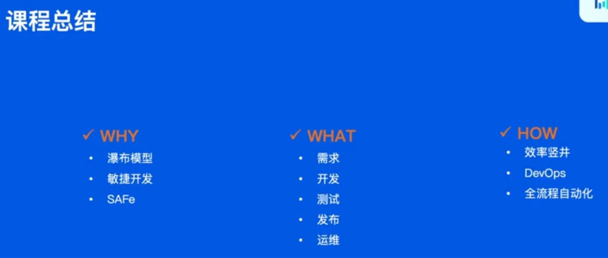
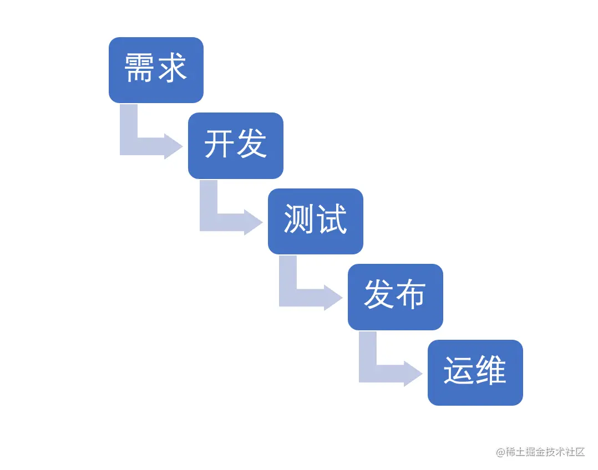
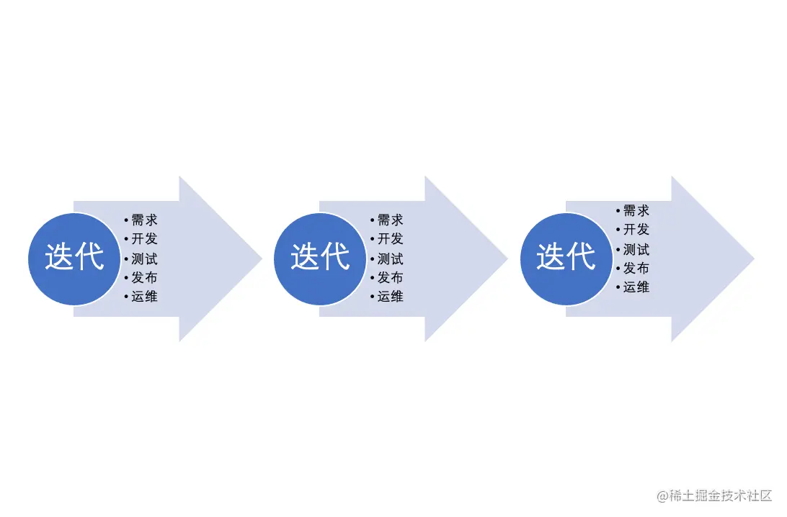
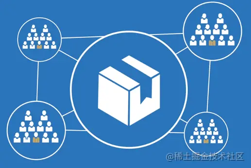
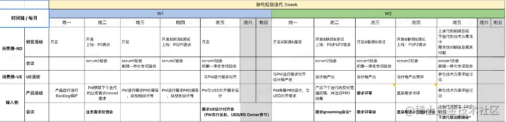
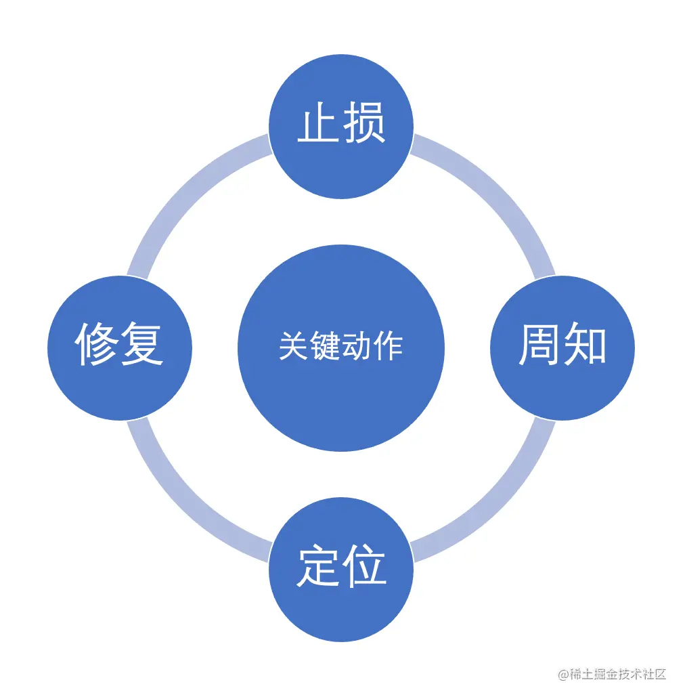
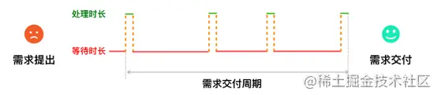

# 从需求到上线全流程

## 软件开发阶段

- 需求阶段
- 开发阶段
- 测试阶段
- 发布阶段
- 运维阶段

## 03 流程怎样优化

### 3.1 怎样让生活更美好

质量  vs 效率?

从需求到上线全流程自动化

### 3.2 DevOps

- 代码管理
- 自动化测试
- 持续集成
- 持续交付 CI/CD

效率竖井

- 流程中实际产生价值的部分很短
- 大量的时间用在等待和传递上
- 人和人之间的沟通很慢

### 3.3 全流程自动化

- 通过效能平台串联各个阶段
- 减少无价值的等待

## 04 后端开发的一周

- 日常: 开发，修bug
- 周一：针对上个迭代开发的功能进行演示，反思上个迭代的不足
- 周二：需求规划会议（Grooming会议），砍需求，拿到了自己的需求
- 周三：提交火车发布车票，Code review，修代码，集成测试，回归测试
- 周四：发布，有问题马上中止发布并回滚，之后修
- 周五：Planning会议，对需求进行排期

## QA

- 程序的功能和用户想要的需求不一样？沟通

# 第七节：从需求到上线全流程

## 概述

**课程背景：** 作为后端研发同学，在一个完整的需求交付周期内究竟要做哪些事情？在各个阶段需要跟不同的角色和平台打交道。介绍常见的研发模式和迭代流程，以实际的例子让同学感受一下后端研发的日常，能够提升大家在团队中协作的能力。

**课程目标：**

1. 提升对流程的认知
2. 熟悉在公司大团队中协作开发
3. 对职业生涯的日常有更直观的理解

## 课前 （必须）

### 词汇表

| 分类                             | 英文            | 中文                                                         | 解释                                                         |
| -------------------------------- | --------------- | ------------------------------------------------------------ | ------------------------------------------------------------ |
| 研发模式                         | Waterfall Model | 瀑布模型                                                     | 瀑布模型（Waterfall Model）最早强调软件或系统开发应有完整之周期，且必须完整的经历周期之每一开发阶段，并系统化的考量分析与设计的技术、时间与资源之投入等。由于该模式强调系统开发过程需有完整的规划、分析、设计、测试及文件等管理与控制，因此能有效的确保系统质量，它已经成为软体业界大多数软件开发的最初标准 |
| The Scaled Agile Framework(SAFe) | 规模化敏捷框架  |                                                              |                                                              |
| Scrum                            | Scrum           | 在软件工程中，Scrum是以经验过程为依据，采用迭代、增量的方法来提高产品开发的可预见性并控制风险的理论，Scrum不是一种过程，也不是一项构建产品的技术，而是一个框架，在Scrum框架中可以应用各种过程和技术，Scrum的作用是让开发实践方法的相对功效显现出来以便随时改进。 Scrum是敏捷(Agile)开发的一种实践模式，敏捷开发强调拥抱需求变化，快速响应不断变化的需求，并尽可能快地提供可以工作的软件产品，敏捷最强调的是可以正常工作的软件产品，文档等不是非常的强调（并非不要文档，只是需要必要的文档），敏捷理论认为面对面的沟通交流远比文档更有效。 敏捷开发的Scrum模式是以价值驱动(Value-Driven)的开发模式，即认为用户的需求并不一定需要100%实现，最重要的是将对用户最有价值的功能实现并交付. |                                                              |
| 流程中的概念                     | Scrum Master    | 敏捷教练                                                     | Scrum Master是Scrum教练和团队带头人，确保团队合理的运作Scrum，并帮助团队扫除实施中的障碍 |
| Product Owner                    | 产品负责人      | 产品负责人，确定产品的方向和愿景，定义产品发布的内容、优先级及交付时间，为产品投资回报率负责； |                                                              |
| Agile Release Train              | 敏捷发布火车    | 敏捷开发的一种发布模式                                       |                                                              |
| RD                               | 研发工程师      | RD一般指Research and Development Engineer，即研发工程师。    |                                                              |
| PM                               | 产品经理        | 产品经理                                                     |                                                              |
| PRD                              | 产品需求文档    | 产品需求文档                                                 |                                                              |
| RD                               | 研发工程师      | RD一般指Research and Development Engineer，即研发工程师。    |                                                              |
| UED                              | 交互设计师      | 用户体验设计师，交互设计师，界面设计师                       |                                                              |
| QA                               | 测试工程师      | 指理解产品的功能要求，并对其进行测试，检查软件有没有缺陷（Bug），测试软件是否具有稳定性（Robustness）、安全性、易操作性等性能，写出相应的测试规范和测试用例的专门工作人员。 |                                                              |
| Backlog                          | 待办事项        | 产品订单（product backlog）是整个专案的概要文档。产品订单包括所有所需特性的粗略的描述。产品订单是关于将要生产什么样的产品。产品订单是开放的，每个人都可以编辑。产品订单包括粗略的估算，通常以天为单位。估算将帮助产品负责人衡量时程表和优先级（例如，如果"增加拼写检查"特性的估计需要花3天或3个月，将影响产品负责人对该特性的渴望）。 冲刺订单（sprint backlog）是大大细化了的文档，包含团队如何实现下一个冲刺的需求的信息。任务被分解为以小时为单位，没有任务可以超过16个小时。如果一个任务超过16个小时，那么它就应该被进一步分解。冲刺订单上的任务不会被分派，而是由团队成员签名认领他们喜爱的任务。 |                                                              |
| Grooming Meeting                 | Grooming会议    | 这个会议上面会由PO来描述下个迭代需要实现的功能，大家讨论要不要干 |                                                              |
| Planning Meeting                 | Planning会议    | 这个会议讨论功能具体什么时候干，要估算任务的工作量           |                                                              |
| 基础知识                         | CNCF            | 云原生计算基金会                                             | 云原生计算是软件开发中的一种方法，它利用云计算“在现代动态环境（例如公共云、私有云和混合云）中构建和运行可扩展的应用程序”。 通过声明性代码部署的容器、微服务、无服务器功能和不可变基础设施等技术是这种架构风格的常见元素。 |
| Kubernetes                       | K8S             | 生产级别的容器编排系统。Kubernetes 是一个可移植的、可扩展的开源平台，用于管理容器化的工作负载和服务，可促进声明式配置和自动化。 Kubernetes 拥有一个庞大且快速增长的生态系统。Kubernetes 的服务、支持和工具广泛可用。 |                                                              |
| FAAS                             | 函数即服务      | 函数即服务。仅通过编写函数（function）就能够发布为一个 API 或者服务，实现业务功能的技术体系。由于处理单元为函数粒度，往往底层也能够支持自动扩缩容地更精细化使用计算资源，开发侧支持事件驱动，可由消息或多种 Hook 触发，同时拥有快速上线、按需付费等优点。 |                                                              |
| APAAS                            | 平台即服务      | 是一个为应用程序服务提供开发和部署环境的云服务               |                                                              |
| IDE                              | IDE             | 用于提供程序开发环境的应用程序。一般包括代码编辑器、编译器、调试器和图形用户界面等工具 |                                                              |
| Git                              | Git             | 分布式的版本管理系统                                         |                                                              |
| Merge/Rebase                     | 合并/变基       | 处理代码分支的操作，将不同的分支整合成一个的两种方式         |                                                              |

## 课中

### 1. 为什么要有流程

#### 团队规模和流程的关系

随着团队规模和问题复杂度的上升，一个人搞定一切就不可能了，超过了一个人，就需要进行团队协作，自然也就需要有流程。
 常见的协作模式：

- 瀑布模型 
- 敏捷开发 
- 规模化敏捷

#### 后端的定位

- 瀑布模式
  - 按照时间节点参与会议，产出文档（系统分析，概要设计，详细设计，接口文档，提测文档等）
  - 按照时间节点交付测试
  - 按照时间节点发布
- 敏捷团队
  - 跟随迭代制定规划，进行开发
  - 参与待办事项整理会议（Backlog Grooming Meeting）
    - PO描述下个迭代希望实现的用户故事
  - 迭代计划会议（Sprint Planning Meeting）
    - 选择迭代的任务和估算工作量
  - 每日站会（Standup Meeting）
    - 昨天你做了什么?
    - 今天你将要做什么?
    - 你有需要帮助的地方吗?
  - 评审会（Retrospective Meeting）
    - 小组向产品负责人展示迭代工作结果
  - 反思会（Retrospective Meeting）
    - 在每个迭代后召开简短的反思会，总结哪些事情做得好，哪些事情做得不好

#### 团队协作

一个具体的迭代时间表：

### 2. 有哪些流程

#### 需求阶段

- 不要浪费时间讨论不应该存在的问题

- 站在用户的角度思考

- 给出后端系统视角的建议，估算任务优先级

#### 开发阶段

- 云原生下的开发：
  - 容器化技术
  - 微服务技术
  - WebIDE

- 团队分支策略：
  - 为什么会有分支策略
  - 有哪些分支策略
  - 合并的方式

- 代码规范
  - 养成良好的注释习惯，超过三个月的代码，自己都会忘了当时在想什么
  - 不要有魔法数字，魔法字符串
  - 重复的逻辑抽象成公共的方法，不要copy代码
  - 正确使用IDE的重构功能，防止修改错误

- 自测
  - 单元测试
  - 功能环境测试
  - 测试数据构造

- 文档
  - 大型改造需要有技术设计文档，方案评审
  - 好的接口文档能更方便的和前端进行沟通

#### 测试阶段

- 功能测试

功能测试，是为了测试一个新开发的功能，因此需要有能模拟线上的开发和测试环境，环境之间能相互隔离，这样可以独立验证不同的新功能

- 集成测试：集成测试，是为了把几个功能合在一起测试，因为可能各个新功能独立测试没有问题，但是合在一起却产生了bug

- 回归测试：回归测试是为了验证老的功能不被新的改动影响

#### 发布阶段

- 各种发布模式
  - 蛮力发布：简单粗暴，直接用新版本覆盖老版本。
  - 金丝雀发布：由于金丝雀对瓦斯极其敏感，因此以前矿工开矿下矿洞前，先会放一只金丝雀进去探是否有有毒气体，看金丝雀能否活下来，金丝雀发布由此得名。
  - 滚动发布：每个实例都通过金丝雀的方式逐步放大流量，对用户影响小，体验平滑
  - 蓝绿发布：常备两个集群，先把流量全部切换到Group 1，升级Group2，然后再把流量全部切换到Group 2，升级Group 1。最终恢复流量。
  - 红黑发布：与蓝绿发布类似，但是日常只有一个集群工作，发布时扩容一个集群升级新版本，切换流量后下掉老版本的集群。

- 发布过程要做的事
  - 发布负责人
    - 负责按照计划执行发布
    - 需要通知各个相关人员发布进展
    - 观察各个服务的发布状态，及时处理异常
  - 变更服务的相关RD
    - 按照上线checklist检查服务的日志，监控，响应上线过程中的告警
    - 对于自己负责的改动，在小流量或者是预览环境进行功能验证
    - 执行发布计划中的其他操作（如线上配置，数据处理等）
  - 值班同学
    - 发布过程中的监控和告警需要特别关注，如果有异常需要立刻判断是否由变更引起
    - 如果有变更引起的告警或者用户反馈，需要及时中止发布

#### 运维阶段

### 3. 怎样执行流程

#### DevOps

- 效率竖井
  - 流程中实际产生价值的部分很短
  - 大量的时间用在等待和传递上
  - 人和人之间的沟通很慢

- DevOps解决方案
  - 代码管理
  - 自动化测试
  - 持续集成
  - 持续交付

#### 全流程自动化

- 通过效能平台串联各个阶段
  - 需求发起研发流程的自动化
  - 写代码，测试环境部署的自动化
  - 自动化测试触发和报告分析
  - 发布过程可观测融入流程

- 减少无价值的等待
  - 分析整个流程的耗时，计算真正产生价值的时间
  - 不断优化流程，让有价值的流程时间占比上升

## 参考文献

1. 瀑布模型 [zh.wikipedia.org/wiki/%E7%80…](https://link.juejin.cn?target=https%3A%2F%2Fzh.wikipedia.org%2Fwiki%2F%E7%80%91%E5%B8%83%E6%A8%A1%E5%9E%8B)

1. Scrum: [zh.wikipedia.org/wiki/Scrum](https://link.juejin.cn?target=https%3A%2F%2Fzh.wikipedia.org%2Fwiki%2FScrum)

1. SAFe：

   a.  [www.woshipm.com/pd/4331832.…](https://link.juejin.cn?target=http%3A%2F%2Fwww.woshipm.com%2Fpd%2F4331832.html)
    b.  [en.wikipedia.org/wiki/Scaled…](https://link.juejin.cn?target=https%3A%2F%2Fen.wikipedia.org%2Fwiki%2FScaled_agile_framework)

1. CNCF：[en.wikipedia.org/wiki/Cloud_…](https://link.juejin.cn?target=https%3A%2F%2Fen.wikipedia.org%2Fwiki%2FCloud_Native_Computing_Foundation)

1. 常用的发布模式：[www.cnblogs.com/Leo_wl/p/14…](https://link.juejin.cn?target=https%3A%2F%2Fwww.cnblogs.com%2FLeo_wl%2Fp%2F14395960.html)

作者：青训营官方账号
链接：https://juejin.cn/post/7097126973163454494
来源：稀土掘金
著作权归作者所有。商业转载请联系作者获得授权，非商业转载请注明出处。
