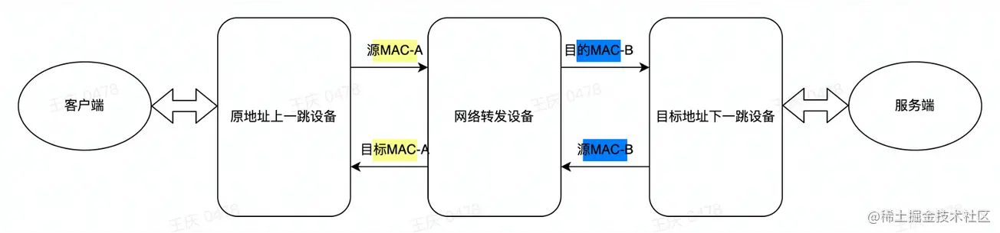
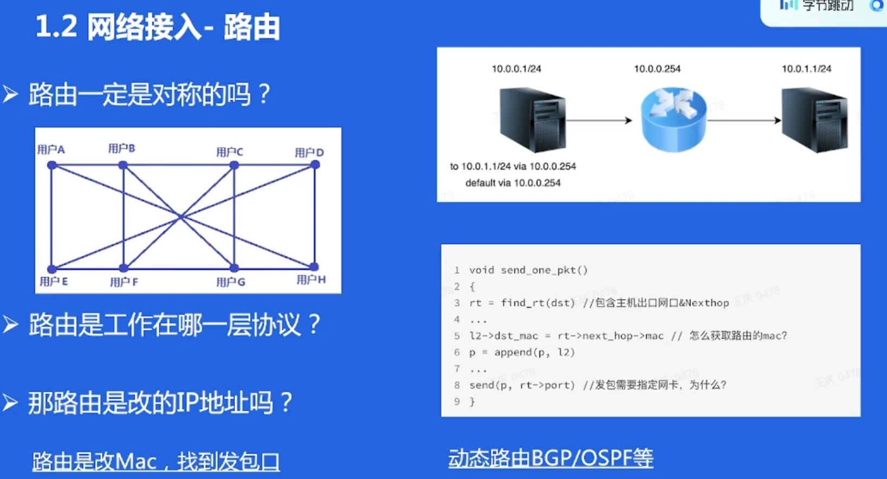
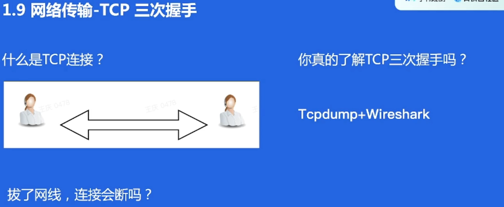
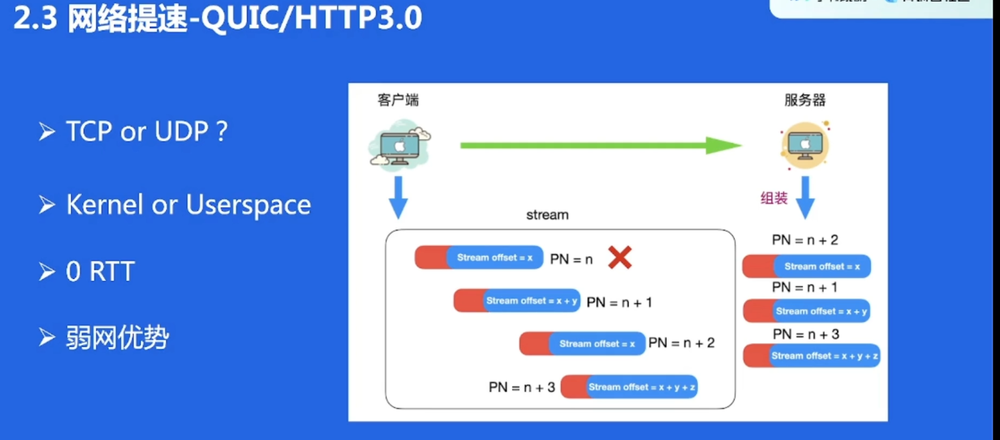

# 第八节：打开抖音互联网会发生什么

## 概述

本节课程主要以刷抖音时的底层互联网交互作为切入点，带大家回顾了计算机网络的相关知识，并结合实际生产环境去理解网络的优化方向和稳定性建设。课程主要分为四个方面：

1. 网络接入协议

1. 网络传输协议

1. 网络优化

1. 网络稳定

课前部分主要罗列课程中涉及到的概念。对于不熟悉的概念，同学们可以提前查询预习；课中部分主要结合实际生产环境理解课本中的一些知识；课后部分是一些问题和参考博客，帮助同学们在课后梳理本课程的重点。

## 课前

> TCP/IP官方标准上并没有网络接入/网络传输协议的区别，这里作者是为了方便大家做一些区分，自己定义了这两大块知识，希望学员不要将这两个概念固化，尽量有自己的理解。

### 课程涉及知识点预习

结合课本知识/网络博客复习相关的知识点，主要如下：

#### 网络接入协议/概念

- MAC地址

- 路由协议

- ARP协议

- IP协议

- NAT

#### 网络传输协议

- DNS

- UDP

- TCP

- HTTP

- HTTPS

- HTTP2.0

- QUIC

### 课程涉及软件/环境安装搭建

#### 操作系统

由于当下互联网的服务端程序以及网络环境大多都是Linux操作系统。所以强烈建议学员有一套可正常运行的Linux环境，如果你没有这个环境，可以：

- 参考一些互联网博客，将你的主机安装成Linux环境（需要安装界面版本，方便安装wireshark）

- 参考一些互联网博客，在你的主机上搭建Linux虚拟机

- 购买/试用一些云厂商的云主机服务（一半默认centos/debian等Linux内核的操作系统）

#### 抓包软件

建议在Linux安装tcpdump软件（apt/yum命令安装，参考相关博客。如无法安装，可以下载源码安装[www.tcpdump.org/）](https://link.juejin.cn?target=http%3A%2F%2Fwww.tcpdump.org%2F%EF%BC%89)

安装wireshark（根据你的主机选择安装版本[www.wireshark.org/，如果是Linux主机…](https://link.juejin.cn?target=https%3A%2F%2Fwww.wireshark.org%2F%EF%BC%8C%E5%A6%82%E6%9E%9C%E6%98%AFLinux%E4%B8%BB%E6%9C%BAhttps%3A%2F%2Fblog.csdn.net%2Fweixin_42405890%2Farticle%2Fdetails%2F116581963%EF%BC%89)

## 课前思考题

> 时间有限，我们无法尽善尽美的给出整个计算机网络的知识和应用，比如下面的这些知识，建议带着这节课的内容再去思考。

1. 按照 TCP/IP 的模型示意图，能否画出数据包的拆包/封包？

1. TCP 的拥塞算法有哪些？课件建议熟练掌握。

1. 建议熟练掌握 socket 编程。

1. 建议阅读 golang/java 等高级编程下的 net 相关库的源码。

1. 了解 Linux kernel 的网络包从收到包到用户态，从用户态发包到网卡整个流程？

## 课中

### 引言

> 思考：为了让抖音工作，网络需要哪些交互？

### 网络接入

- 互联网的接入：网络拓扑的整体认知

  

- 路由发包原理：

  - 同网段：配置网段即可默认添加静态路由。获取对端MAC直接发包

  

  - 跨网段：配置网关路由。获取网关MAC地址发包

  

  - 动态路由：BGP/OSPF等，路由表在动态变化
  - 路由是网状的，不一定是对称的

  

- ARP协议
  - ARP广播/应答：协议原理
  - 免费ARP：主动广播告知MAC地址
  - ARP代理：虚拟网络/伪造MAC地址

- IP协议
  - IPv4：互联网终端节点的唯一标识
  - IPv6：不仅仅是IP地址长度的增加

- NAT

  

  - NAT上网：家用路由器
  - NAT出网：机房内网主机上外网
  - NAT原理：注意不仅仅是源地址变换，源端口/校验和/SEQ等都会变化

### 网络传输

- 数据包：本质上是一段内存，里面存储的内存是有序的，一般是按照TCP/IP的多层协议去封装。拆包/封包都是按照协议去写内存/读内存。

- DNS递归迭代

- UDP
  - 协议简单
  - 需要考虑可靠性的场景使用复杂

- TCP
  - 三次握手：确认传输的序列号/MSS/Option字段，建立连接
  - TCP连接：是一个虚拟的概念，本质上两倍维持一段内存，记录连接状态，就是session
  - TCP传输：理解sequence number/acknowledge number
  - 丢包重传：理解丢包怎么感知并重传，理解快速重传发生在什么时候
  - 滑动窗口：课后自学
  - 流量控制：课后自学

- HTTP
  - HTTP比TCP好在哪里：方便
  - HTTP1.1的优化：长连接是重点

- HTTPS
  - HTTPS的产生背景：加密/可靠/防劫持
  - SSL/TLS握手：非对称加密/对称加密

### 网络提速

- HTTP2.0
  - 多路复用：依然有队头阻塞

- QUIC

  - QUIC的产生背景和背后思考：

    - 为什么在用户态实现？内核的更新迭代频率较低，不好推广
    - 为什么用UDP？TCP的队头阻塞问题不好解决，推倒重来&复用所有操作系统基本都支持的底层协议

    

- 数据中心建设

  

  - 多运营商接入：同运营商内部访问，避免跨运营商的流量
  - 有边缘机房/汇聚机房/中心机房

- CDN静态缓存系统：边缘机房的建设，优先访问边缘机房，缓存命中视频/图片等静态内容

- DSA动态加速系统：分四层/七层动态加速。核心在于利用可控节点做路径探测和规划。

### 网络稳定

- 对容灾的理解

  

- 网络容灾的具体案例

  - 机房专线故障：环路容灾，避免某条专线故障导致机房孤岛问题（专线是连接各个机房的网络物理路径）

  

  - 单机房接入节点故障：DNS容灾，摘除故障的节点-字节GTM系统

  

  - 云控容灾：云端交互，服务器/云上下发命令到终端-字节TNC系统

  

  - cache容灾：源站不可用，降级到之前的缓存内容-字节TLB/ByteCDN等系统的容灾建设

  

- 故障排查

  

  - 加强故障沟通-明确故障
  - 故障止损要在第一时间做（灾备预案的建设）
  - 熟悉常用的故障排查命令

- 故障排查的具体案例

  - 服务端配置异常（健康检查异常）

  

  - 客户端某个例异常（客户端自己配置错误）

  

  - 外部运营商故障

  

  - 复杂故障的排查：需要抓包，具体问题具体分析

  

## 课后

#### 课后作业1- UDP socket 实现 ack，感知丢包重传

作业要求：

1. 学会 UDP socket 编程

1. 先从简单的 ack 学习，客户端等待 ack 再发包

1. 什么时候客户端认为是丢包？

1. 重传怎么考虑效率？

1. 能不能不阻塞只穿丢掉的中间的段？

#### 课后作业2- 三台同网段内的服务器，模拟实现一个路由器

**方法一: Linux 操作系统配置法**

提示：

1. 了解Linux的路由配置方式

1. 确保是同网段直连可达的环境。在三台机器上另外配置IP网段和路由

1. 一台机器做客户端，一台机器做路由器，一台机器做服务端

1. 客户端配置到达服务器的下一跳指向路由器，路由器上配置到达服务端的路由

**方法二:** **用户态** **socket 编程实现简易 route 软件**

提示：

1. 收到指定的包后，做转发

1. 注意是修改报文的 MAC ，不是修改 IP

1. 实现一个对称路由。这样可以实现 TCP 交互

1. 可以通过 ping 来验证

1. 可以支持 traceroute 吗？

## 文献推荐

- 《TCP/IP 详解》-计算机网络指导手册

- 《Linux Kernel develepment》-初步窥探内核实现

- 《深入理解 Linux 网络技术内幕》-TCP/IP 底层编码

作者：青训营官方账号
链接：https://juejin.cn/post/7097126973163454494
来源：稀土掘金
著作权归作者所有。商业转载请联系作者获得授权，非商业转载请注明出处。

# 课程内容 

简历：熟悉计算机网络

这里的HTTP指泛HTTP：HTTP1,2,3 或者 QUIC

## 目录

- 刷抖音时网络是怎么交互的？
- 刷抖音为什么又快又稳？
- 总结回顾

## 1 刷抖音时网络是怎么交互的？

- 网络接入
- 网络传输

出问题的一般是最后一公里，以上网络都很稳定

子网掩码，网段

交换机/逻辑交换机，三层，就是有自己的IP地址

SDN：同网段不一定是同一个物理交换机

回答：改一下目标IP的MAC

免费ARP：

- 新增了服务器，告诉其他机器更新一下MAC列表，不然没有MAC列表的缓存
- 服务器新增了IP，发送免费ARP，看看有没有IP冲突

ARP代理：

- 就是一个代理，可以类比VPN代理
- 有一个中间设备，可以抢先应答ARP的请求，做一些SDN中的高级功能

### ARP的本质是查找下一跳的MAC，不是请求目标地址

NAT改的是IP+端口

### 网络打通后，视频怎么下载呢？

拔了网线，TCP连接会断吗？ ------ 有探活的机制

MSS，在TCP三次握手的时候确认MSS，MSS和分片相关

TCP-OPTION字段，以MSS为例，三次握手取双方最小的MSS作为协商结果；时间戳等等

## 02 网络架构怎么给抖音提质

- 网络提速
- 网络稳定

HTTP 2.0：多路复用

队头阻塞

解决：QUIC / HTTP3.0

Google很强：HTTP升级版，Go语言，K8S

- HTTP协议栈写死在Linux上，不可插拔
- 内核态的话，所有操作系统都要去实现一遍啊，所以选择用户态
- 天然支持HTTPS
- 弱网传输：容易丢包->队头阻塞，QUIC就能解决

### 除了协议优化，网络路径能不能优化？

哪些路径优化算法

- CDN
- P2P
- ANYCAST
- 遗传算法，强化学习算法
- 动态加速
- 。。。。

- 域名，智能解析
- 跨运营商质量不好（中国国情）

- 在边缘机房做缓存

- 先查一下边缘机房，之前有人访问过的话，再往里面走
- CDN本质上是一个静态缓存系统

动态资源

- 网络延时探测，做成一张表，根据表来做最优路径规划（类似于路由规划）

### 刷得快，但是三天两头挂掉，谁刷抖音？

- 专线：内部拉线，不走外部Internet

- 外网：机房内部专线以外的，

- 外网容灾：专线不可用了，就走外网容灾

- 调度容灾：自动去掉挂掉的机房
- 防止雪崩：确保B机房容量够用

- 云端容灾：云控，app嵌入sdk
- 局限性：
  - 云控本身挂了
  - web页面的话，不能用专门给SDK开发的东西

- hello之前缓存过了，就把上一次响应的数据再次返回回去

### 没用容灾的故障怎么查？

## QA

- SOCKET：是实现HTTP、TCP协议实现的方式，但他不是一种协议
- iptables 和 ipvs
  - iptables: 实现了一些钩子，进行包过滤传输等，防火墙就是这样的
  - ipvs: 华人之光，负载均衡，在net filter框架上做了一些钩子，转发模式，之后有很多二次开发
- ipv6为什么没有推广起来？
  - 历史遗留问题，目前只能走双栈
  - 不是运营商故意不升级，国家层面是强推的，但不能一下子
- web socket协议的优势，比起HTTP3
- 

