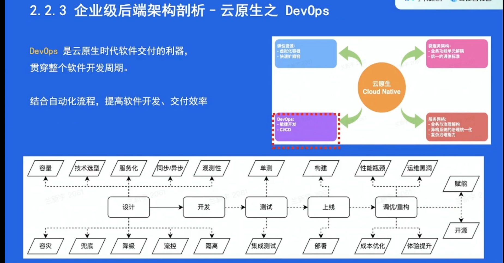
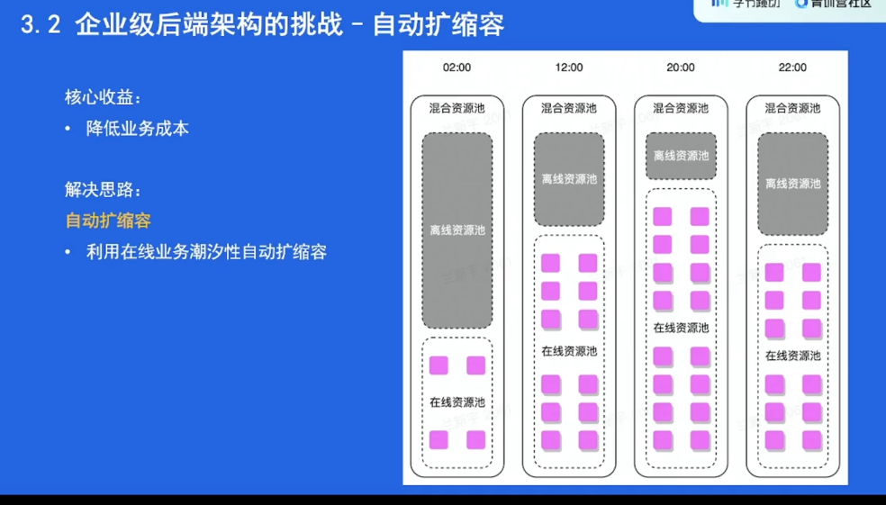

# 第十节：架构初探 - 谁动了我的蛋糕

## 使用指南

为了帮助同学们更好地理解本课程，我为大家准备了本学员手册。它包含以下几大模块内容：

- 课程目标，本课程主要框架的简单介绍，便于同学们抓住课程的框架结构，把握听课节奏；

- 课前，本课程的重要前置知识点，便于同学们在听课过程中快速理解、跟紧思路；

- 课中，本课程各章节涉及的关键概念和知识点，帮助同学们加深核心内容的理解和认识；

- 课后，本课程的内容提炼，便于同学们总结课程要点，争取达到举一反三的效果。

## 课程目标

本课程的包含以下四个方面：

- 什么是架构
  - 围绕架构的定义和演进两部分内容展开

- 企业级后端架构剖析
  - 详细介绍企业级后端架构的形态

- 企业级后端架构的挑战
  - 企业级架构都面临着哪些挑战，如何解决

- 后端架构实战
  - 结合前三部分的知识点，以第三部分中的一个挑战为例，讲解如何做架构设计

## 课前

### 什么是架构

常见软件架构：

- 单机

- 单体

- 垂直应用

- SOA (Service Oriented Architecture)

- 微服务 (Microservice)

> 📌 一些小问题：
>
> - 如何给架构下定义？
> - 架构的重要性？
> - 架构演进的初衷？
> - 架构演进的思路？

### 企业级后端架构剖析

- 云计算
  - 基础
    - 虚拟化
    - 编排
  - 架构
    - IaaS
    - SaaS
    - PaaS
    - FaaS

- 云原生
  - 弹性资源
    - 计算资源
    - 存储资源
  - 微服务架构
    - 通信协议
    - 中间件
  - DevOps
    - 软件生命周期
  - 服务网格

### 企业级后端架构的挑战

- 离线任务

- 在线任务

- IO 密集型

- CPU 密集型

- 服务治理

- IPC (Inter-Process Communication)

- RPC (Remote Procedure Call)

### 后端架构实战

- 负载均衡 Load Balancing

- 服务发现 Service Discovery

- 服务注册 Service Registry

- 宿主机 Host

- 容器 Container

- 时序数据 Time Series

- 一致性哈希 Consistent Hash

## 课前思考题

1. 软件架构演进至今都有哪些形态？它们分别解决了什么问题？仍然存在什么问题？

1. 云计算有哪些基础技术？云计算服务的形态又有哪些？

1. 云原生是什么？它跟云计算的关系是？

1. 云原生的代表技术有哪些？

1. 企业级后端架构面临的挑战有哪些？

## 课中

### 什么是架构

#### 架构定义

**Q：如何给架构下定义？**

A：架构，又称软件架构：

- 是有关软件整体结构与组件的抽象描述

- 用于指导软件系统各个方面的设计

**Q：架构的重要性？**

A：那盖房子来做举例子。

我们都知道，地基对于一栋楼房的主要性，架构对于一个软件的重要性也是类似的：

- 架构没设计好，软件容易崩，用户体验上不去。最终要么重构，要么放弃

- 架构设计好了，软件的稳定性上去了，用户体验高了，口碑一点点就打造出来了

- 良好的架构基础，也为软件的未来发展提供了更多的可能。为用户赋能，实现自身价值

#### 单机架构

All in one，所有的东西都在一个进程里，部署在一个机器上。

优点：

- 简单

缺点：

- 运维需要停服，用户体验较差

- 承载能力有限。**了解下 c10k 问题**

#### 单体架构

在单机架构的基础上，将进程部署到多个机器上。

优点：

- 具备水平扩容能力

- 运维不需要停服

缺点：

- 后端进程职责太多，越来越臃肿

- 爆炸半径较大，进程中一个很小的模块出现问题，都可能导致整个进程崩溃

#### 垂直应用架构

在单机架构基础上，将进程按照某种依据切分开。比如，A 软件和 B 软件的后端原先采用单机架构部署，那就是一个进程部署在多个机器上；如果用垂直应用架构，可以将 A 和 B 的后端拆分为 A、B 两个进程，然后再按照单体模式的思路，部署在多个机器上。

优点：

- 一定程度上减少了后端进程职责

- 一定程度上缩小爆炸半径

缺点：

- 没有根本解决单体架构的问题

#### SOA (面向服务架构)

SOA 架构中，服务为一等公民，将进程按照不同的功能单元进行抽象，拆分为『服务』。有了服务之后，SOA 还为服务之间的通信定义了标准，保证各个服务之间通讯体验的一致性。

优点：

- 各服务的职责更清晰

- 运维粒度减小到服务，爆炸半径可控

缺点：

- ESB (企业服务总线) 往往需要一整套解决方案

#### 微服务

在 SOA 架构中，ESB 起到了至关重要的作用。但从架构拓扑来看，它更像是一个集中式的模块。有一个 SOA 分布式演进的分支，最终的形态便是微服务。

优点：

- 兼具 SOA 解决的问题

- 服务间的通信更敏捷、灵活

缺点：

- 运维成本

#### 小结

- 架构演进的初衷：满足软件迭代诉求，提高迭代效率

- 架构演进的思路：垂直切分——分布式，水平切分——分层/模块化

### 企业级后端架构剖析

#### 云计算

云计算基础：

- 虚拟化技术
  - 硬件层面（VM 虚拟机）- KVM/Xen/VMware
  - 操作系统层面（Container 容器）- LCX/Docker/Kata Container
  - 网络层面 - Linux Bridge/Open v Switch

- 编排方案
  - VM - OpenStack/VMWare Workstation
  - Container - Kubernetes/Docker Swarm

云计算架构：

- 云服务
  - IaaS - 云基础设施，对底层硬件资源池的抽象
  - PaaS - 基于资源池抽象，对上层提供的弹性资源平台
  - SaaS - 基于弹性资源平台构建的云服务
  - FaaS - 更轻量级的函数服务。好比 LeetCode 等 OJ，刷题时只需要实现函数，不需要关注输入输出流

- 云部署模式（拓展）
  - 私有云 - 企业自用
  - 公有云 - AWS/Azure/Google Cloud/Huawei
  - 混合云

#### 云原生

云原生，实际是云原生（计算）的简称，它是云计算发展到现在的一种形态。

云原生技术为组织（公司）在公有云、自由云、混合云等新型的动态环境中，构建和运行可弹性拓展的应用提供了可能。 它的代表技术：

- 弹性资源

- 微服务架构

- DevOps

- 服务网格

##### 弹性资源

基于虚拟化技术，提供的可以快速扩缩容的能力。可以分为弹性计算资源和弹性存储资源两个方面。
 弹性计算资源：

- 计算资源调度
  - 在线计算 - 互联网后端服务
  - 离线计算 - 大数据分析。Map-Reduce/Spark/Flinnk

- 消息队列
  - 在线队列 - 削峰、解耦
  - 离线队列 - 结合数据分析的一整套方案，如 ELK

弹性存储资源：

- 经典存储
  - 对象存储 - 视频、图片等。结合 CDN 等技术，可以为应用提供丰富的多媒体能力
  - 大数据存储 - 应用日志、用户数据等。结合数据挖掘、机器学习等技术，提高应用的体验

- 关系型数据库

- 元数据
  - 服务发现

- NoSQL
  - KV 存储 - Redis
  - 文档存储 - Mongo

在云原生的大背景下，不论是计算资源还是存储资源，他们都像是服务一样供用户使用。

##### 微服务架构

微服务架构下，服务之间的通讯标准是基于协议而不是 ESB 的。

- HTTP - H1/H2

- RPC - Apache Thrift/gRPC

如何在 HTTP 和 RPC 之间选择？

- 性能 - RPC 协议往往具备较好的压缩率，性能较高。如 Thrift, Protocol Buffers

- 服务治理 - RPC 中间件往往集成了丰富的服务治理能力。如 熔断、降级、超时等

- 可解释性 - HTTP 通信的协议往往首选 JSON，可解释性、可调试性更好

##### 服务网格

什么是服务网格？

- 微服务之间通讯的中间层

- 一个高性能的 4 层网络代理

- 将流量层面的逻辑与业务进程解耦

没有什么是加一层代理解决不了的问题，服务网格相比较于 RPC/HTTP 框架：

- 实现了异构系统治理体验的统一化

- 服务网格的数据平面代理与业务进程采取进程间通信的模式，使得流量相关的逻辑（包含治理）与业务进程解耦，生命周期也更容易管理

### 企业级后端架构的挑战

#### 挑战

基础设施层面：
 Q：我们总说，云是弹性的，也就是说，在用户的角度，云提供的资源是无限的。然而，云背后的物理资源是有限的。在企业级后端架构里，云如何解决近乎无限的弹性资源和有限的物理资源之间的矛盾？

Q：闲事的资源就这么空着呢？如何提高资源利用率，提高物理资源的价值转换率？

用户层面：
 Q：上了云原生微服务后，服务之间的通信开销较大，应该如何做成本优化？

Q：微服务看起来没有那么美好，抖动导致的运维成本较高，如何解决？

Q：异构的物理环境应该对用户是透明的，如何屏蔽这些细节？

#### 离在线资源并池

考虑到在线业务的**潮汐性**，物理资源的用量不是一成不变的。离在线资源并池，可以：

- 提高物理资源利用率

- 提供更多的弹性资源

#### 微服务亲合性部署

微服务之间的通信成本较高，是否可以：

- 形态上是微服务架构

- 通信上是单体架构

亲合性部署，通过将微服务调用形态与资源调度系统结合，将一些调用关系紧密、通信量大的服务部署在同一个机器上，并且使用 IPC 代替 RPC 的方式，降低网络通信带来的开销

#### 流量治理

Q：微服务之间的通信流量为什么需要治理？

Q：都有哪些常用的治理手段？

Q：微服务中心件和服务网格在其中扮演着怎样的角色？

#### 屏蔽异构环境的算力差异

Q：基础设施层往往是个复杂的异构环境，比如，有些机器的 CPU 是英特尔的，而有些是 AMD 的。就算是同一个品牌，也可能是不同代际。如何将这些差异屏蔽掉，使用户尽可能不感知呢？

Q：什么情况下，我们觉得，服务需要扩容了？异构环境会对这个评判标准产生怎样的影响？

### 后端架构实战

#### 问题

如何设计一个根据主机层面的资源信息，实时进行流量调度的系统，打平不同宿主机异构环境的算力差异。

关键点：

- 紧急回滚能力

- 大规模

- 极端场景

## 课后

###### 课后作业-兰师傅蛋糕房要支持线上售卖了！请帮忙做整套系统的架构设计

**设计需求：**

1. 多端支持

   a. 微信/支付宝小程序
    b. App
    c. 网页

1. 使用云原生基础设施

1. 用户画像很重要

1. 积极参加妇女节/光棍节等活动

**⚠️注意：** 不需要考虑与做蛋糕相关服务的交互

## 尾声

1. 没有最好的架构，只有最合适的架构

1. 做架构设计

   a. 先从需求出发。要满足什么样的需求？预期规模有多大？
    b. 做足够的业界调研。业界对于类似的需求是怎么做的？有无成熟的方案可以借鉴？直接拿来用有什么问题？
    c. 技术选型。涉及的技术组件是自研，还是使用开源的？
    d. 异常情况。任何时候，都不能做『输入合法』的假设。容灾能力一定要有

1. 学好架构，是工程师成长的一个重要标志

## 参考文献

- [C10K 问题](https://link.juejin.cn?target=http%3A%2F%2Fwww.kegel.com%2Fc10k.html)

- [CNCF](https://link.juejin.cn?target=https%3A%2F%2Fwww.cncf.io%2F)

- [CNCF landscape](https://link.juejin.cn?target=https%3A%2F%2Flandscape.cncf.io%2F)

作者：青训营官方账号
链接：https://juejin.cn/post/7098182433941651492
来源：稀土掘金
著作权归作者所有。商业转载请联系作者获得授权，非商业转载请注明出处。

## 课程目录

### 01 什么是架构

### 02 企业级后端架构剖析

### 03 企业级后端架构的挑战

### 04 后端架构实战

演进：如何卖出更多的蛋糕？

多雇几个蛋糕师傅

按不同应用分

演进：如何提高做蛋糕的效率？

比较好的分工协作。。

### 02 企业级后端架构剖析

问题：同一个机器怎么做在线隔离？

cgroup或容器虚拟化，用不同的CPU核心组

问题：扩容缩容依据什么指标？

不同场景

- CPU的使用量，微服务，p50
- 内存+cpu

- I/O比较困难，对资源做I/O隔离很困难，可行性一般
- QPS/KPS:不同服务指标不好比较，不公平

### 04 后端架构实践

1. 需要哪些输入？
2. 设计时需要考虑哪些关键点？

## Q&A

- FaaS之后还可能细分吗？
  - 可能
- 扩容时，选择增加容器数量而不是更改原有容器的CPU等性能参数