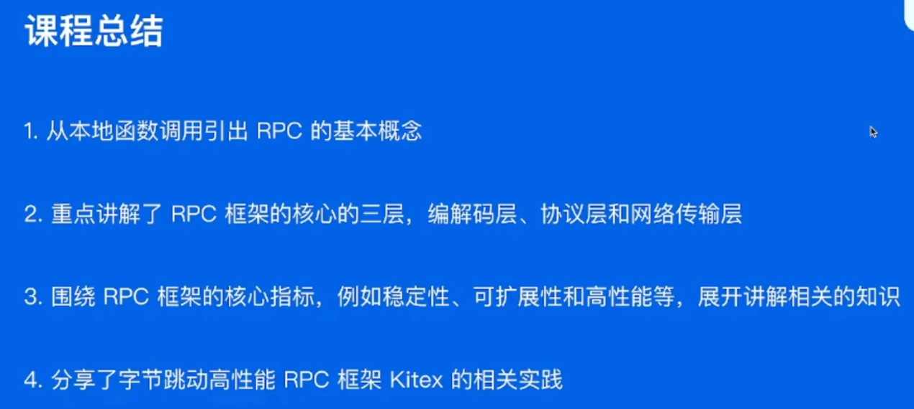

# 深入浅出RPC框架

## 目录

- 01 关键概念
- 02 分层设计
- 03 关键指标
- 04 企业实践

## 01 基本概念

ubuntu下选择指定区域截屏并且放入剪贴板: shift + ctrl + prtsc


远程调用

- 不同进程,给函数绑定ID
- 不同进程,数据要转换成字节流
- 高校稳定传输数据


## 02 分层设计


## 03 关键指标

- 稳定性
- 易用性
- 扩展性
- 观测性
- 高性能


## 04 企业实践

- 整体架构
- 自研网络库
- 扩展性设计
- 性能优化
- 合并部署




## Q&A

- thrift和protobuf编码方式的不同
- rpc的协议层是在TCP之上构造的,可以认为是一种应用层协议
- tag和length字段的长度是固定的
- rpc和gin中间件的区别
- 其实今天来看protobuf的生态比thrift要好
- 观测三件套: 
  - log,日志,日志平台,log agent;
  - metrics,打点,计算耗时,上报agent,传输到一个地方,平台集中化展示;普罗米休斯(时序数据库),个如埃弗呢(展示平台)
  - tracing,跟踪链路在每个阶段的耗时,雅各,展示平台;
- 服务发现
  - etcd
  - 看色呢
- 服务发现是框架实现的还是依赖第三方注册中心?
  - kitex也要对接第三方注册中心
- k8s调度实现负载均衡
- 大部分人会选择RPC框架
  - 灵活性
  - 功能多,能覆盖http服务
- k8s支持的节点数量有限,弹幕有人说的

# 第十三节：深入浅出 RPC 框架

## 概述

本节课程主要分为四个方面：

1. RPC 相关的基本概念

1. RPC 框架的分层设计

1. 衡量 RPC 框架的一些核心指标

1. 字节内部 RPC 框架 Kitex 实践分享

**课前部分**主要罗列课程中涉及到的概念。对于不熟悉的概念，同学们可以提前查询预习；

**课中部分**主要罗列每一部分的关键思路，帮助同学们跟上课程的进度；

**课后部分**是一些问题，帮助同学们在课后梳理本课程的重点。

## 课前

### RPC 的基本概念

- RPC的概念模型：User、User-Stub、RPC-Runtime、Server-Stub、Server
  - 来自论文《[Implementing Remote Procedure Calls](https://link.juejin.cn?target=https%3A%2F%2Fweb.eecs.umich.edu%2F~mosharaf%2FReadings%2FRPC.pdf)》

- IDL(Interface Definition Language) 文件
  - Thrift
  - Protobuf

- 生成代码

- 编解码（序列化/反序列化）

- 通信协议
  - 应用层协议

- 网络通信
  - IO 网络模型
    - blocking IO
    - unblocking IO
    - IO multiplexing
    - signal driven IO
    - asynchronous IO
  - 传输层协议
    - TCP
    - UDP

### RPC 框架分层设计

- 编解码层
  - 数据格式：
    - 语言特定格式
    - 文本格式
    - 二进制编码
      - TLV 编码：Thrift 使用 TLV 编码
      - Varint 编码：Protobuf 使用 Varint 编码
  - 选项：
    - 兼容性
    - 通用型
    - 性能

- 传输协议层
  - 消息切分
    - 特殊结束符
    - 变长协议：length+body
  - 协议构造
    - 以 Thrift 的 [THeader](https://link.juejin.cn?target=https%3A%2F%2Fgithub.com%2Fapache%2Fthrift%2Fblob%2Fmaster%2Fdoc%2Fspecs%2FHeaderFormat.md) 协议为例讲解

- 网络通信层
  - 网络库
  - 核心指标
    - 吞吐高
    - 延迟低

### RPC 框架的核心指标

- 稳定性
  - 保障策略
    - 熔断
    - 限流
    - 超时
  - 请求成功率
    - 负载均衡
    - 重试
  - 长尾请求
    - BackupRequest

- 易用性
  - 开箱即用
  - 周边工具

- 扩展性

- 观测性
  - Log
  - Metric
  - Tracing
  - 内置观测性服务

- 高性能

### 字节内部 Kitex 实践分享

- [Kitex](https://link.juejin.cn?target=https%3A%2F%2Fgithub.com%2Fcloudwego%2Fkitex) 整体架构

- 自研网络库 [Netpoll](https://link.juejin.cn?target=https%3A%2F%2Fgithub.com%2Fcloudwego%2Fnetpoll)

- [性能优化](https://link.juejin.cn?target=https%3A%2F%2Fwww.infoq.cn%2Farticle%2Fspasfyqgaaid5rguinl4)：
  - 网络库优化
  - 编解码优化

- 合并部署

## 课中

### 基本概念

- 相比本地函数调用，RPC调用需要解决的问题
  - 函数映射
  - 数据转换成字节流
  - 网络传输

- 一次 RPC 的完整过程

- RPC 带来的问题将由 RPC 框架来解决
  - 服务宕机如何感知？
  - 遇到网络异常应该如何应对？
  - 请求量暴增怎么处理？

### RPC 框架分层设计


#### 编解码层

- 数据格式
  - 语言特定格式：例如 java.io.Serializable
  - 文本格式：例如 JSON、XML、CSV 等
  - 二进制编码：常见有 Thrift 的 BinaryProtocol，Protobuf，实现可以有多种形式，例如 TLV 编码 和 Varint 编码

- 选型考察点
  - 兼容性
  - 通用型
  - [性能](https://link.juejin.cn?target=https%3A%2F%2Fgithub.com%2Falecthomas%2Fgo_serialization_benchmarks)
    - 空间开销
    - 时间开销

- 生成代码和编解码层相互依赖，框架的编解码应当具备扩展任意编解码协议的能力


#### 协议层

- 以 Thrift 的 THeader 协议为例

  

  - LENGTH 字段 32bits，包括数据包剩余部分的字节大小，不包含 LENGTH 自身长度
  - HEADER MAGIC 字段16bits，值为：0x1000，用于标识 协议版本信息，协议解析的时候可以快速校验
  - FLAGS 字段 16bits，为预留字段，暂未使用，默认值为 0x0000
  - SEQUENCE NUMBER 字段 32bits，表示数据包的 seqId，可用于多路复用，最好确保单个连接内递增
  - HEADER SIZE 字段 16bits，等于头部长度字节数/4，头部长度计算从第14个字节开始计算，一直到 PAYLOAD 前（备注：header 的最大长度为 64K）
  - PROTOCOL ID 字段 uint8 编码，取值有： - ProtocolIDBinary = 0 - ProtocolIDCompact = 2
  - NUM TRANSFORMS 字段 uint8 编码，表示 TRANSFORM 个数
  - TRANSFORM ID 字段 uint8 编码，表示压缩方式 zlib or snappy
  - INFO ID 字段 uint8 编码，具体取值参考下文，用于传递一些定制的 meta 信息
  - PAYLOAD 消息内容

- 协议解析


#### 网络通信层


- 阻塞 IO 下，耗费一个线程去阻塞在 read(fd) 去等待用足够多的数据可读并返回。

- 非阻塞 IO 下，不停对所有 fds 轮询 read(fd) ，如果读取到 n <= 0 则下一个循环继续轮询。

第一种方式浪费线程（会占用内存和上下文切换开销），第二种方式浪费 CPU 做大量无效工作。而基于 IO 多路复用系统调用实现的 Poll 的意义在于将可读/可写状态通知和实际文件操作分开，并支持多个文件描述符通过一个系统调用监听以提升性能。
 网络库的核心功能就是去同时监听大量的文件描述符的状态变化(通过操作系统调用)，并对于不同状态变更，高效，安全地进行对应的文件操作。

### RPC 框架核心指标

#### 稳定性

- 保障策略
  - 熔断
  - 限流
  - 超时控制


从某种程度上讲超时、限流和熔断也是一种服务降级的手段 。

- 请求成功率
  - 负载均衡
  - 重试

- 长尾请求
  - BackupRequest


#### 易用性

- 开箱即用
  - 合理的默认参数选项、丰富的文档

- 周边工具
  - 生成代码工具、脚手架工具

#### **扩展性**

- Middleware：middleware 会被构造成一个有序调用链逐个执行，比如服务发现、路由、负载均衡、超时控制等

- Option：作为初始化参数

- 核心层是支持扩展的：编解码、协议、网络传输层

- 代码生成工具也支持插件扩展


#### 观测性

- 三件套：Log、Metric 和 Tracing


- 内置观测性服务，用于观察框架内部状态
  - 当前环境变量
  - 配置参数
  - 缓存信息
  - 内置 pprof 服务用于排查问题

#### 高性能

- 连接池和多路复用：复用连接，减少频繁建联带来的开销

- 高性能编解码协议：Thrift、Protobuf、Flatbuffer 和 Cap'n Proto 等

- 高性能网络库：Netpoll 和 Netty 等

### 字节内部 Kitex 实践分享

1. 框架文档 [Kitex](https://link.juejin.cn?target=https%3A%2F%2Fwww.cloudwego.io%2Fzh%2Fdocs%2Fkitex%2F)

1. 自研网络库 [Netpoll](https://link.juejin.cn?target=https%3A%2F%2Fwww.cloudwego.io%2Fzh%2Fdocs%2Fnetpoll%2F)，背景：

   a.  原生库无法感知连接状态
    b.  原生库存在 goroutine 暴涨的风险

1. 扩展性：支持多协议，也支持灵活的自定义协议扩展

1. 性能优化，参考 [字节跳动 Go RPC 框架 KiteX 性能优化实践](https://link.juejin.cn?target=https%3A%2F%2Fwww.infoq.cn%2Farticle%2Fspasfyqgaaid5rguinl4)

   a.  网络优化

   ```
   i.  调度优化  
   ii.  LinkBuffer 减少内存拷贝，从而减少 GC  
   iii.  引入内存池和对象池
   复制代码
   ```

   b.  编解码优化

   ```
   i.  Codegen：预计算提前分配内存，inline，SIMD等
   ii.  JIT：无生产代码，将编译过程移到了程序的加载（或首次解析）阶段，可以一次性编译生成对应的 codec 并高效执行
   复制代码
   ```

1. 合并部署

   a.  微服务过微，引入的额外的传输和序列化开销越来越大
    b.  将强依赖的服务统计部署，有效减少资源消耗

## 课后

1. 行业内各个流行的 RPC 框架的优劣对比

1. 从第三章节 RPC 的核心指标来看，Kitex 还有哪些功能是欠缺或者需要加强的？

1. 了解微服务的新趋势 ServiceMesh，以及 RPC 框架和 ServiceMesh 的关系

1. 关于 RPC 框架，业界有哪些新的趋势和概念？

1. Netpoll 的优势在哪？相比其他高性能网络库例如 Netty 还有什么不足？

1. Flatbuffer 和 Cap'n Proto 等编解码协议为什么高性能？

## 参考文献

1. 官方文档 [Kitex](https://link.juejin.cn?target=https%3A%2F%2Fwww.cloudwego.io%2Fzh%2Fdocs%2Fkitex%2F) [Netpoll](https://link.juejin.cn?target=https%3A%2F%2Fwww.cloudwego.io%2Fzh%2Fdocs%2Fnetpoll%2F)

1. [字节跳动 Go RPC 框架 KiteX 性能优化实践_架构_字节跳动技术团队_InfoQ精选文章](https://link.juejin.cn?target=https%3A%2F%2Fwww.infoq.cn%2Farticle%2Fspasfyqgaaid5rguinl4)

1. [字节跳动微服务架构体系演进_架构_字节跳动技术团队_InfoQ精选文章](https://link.juejin.cn?target=https%3A%2F%2Fwww.infoq.cn%2Farticle%2Fasgjevrm8islszo7ixzh)

作者：青训营官方账号
链接：https://juejin.cn/post/7099665398655615006/
来源：稀土掘金
著作权归作者所有。商业转载请联系作者获得授权，非商业转载请注明出处。


### 课后作业- 重点内容 Review

1. 行业内各个流行的 RPC 框架的优劣对比？

1. 从第三章节 RPC 的核心指标来看，Kitex 还有哪些功能是欠缺或者需要加强的？

1. 了解微服务的新趋势 ServiceMesh，以及 RPC 框架和 ServiceMesh 的关系

1. 关于 RPC 框架，业界有哪些新的趋势和概念？

2. Netpoll 的优势在哪？相比其他高性能网络库例如 Netty 还有什么不足？

3. Flatbuffer 和 Cap'n Proto 等编解码协议为什么高性能？

   < 作业提交截止时间：5月24日 10:00前 >


作者：社区助手
链接：https://juejin.cn/post/7099742161540743198/
来源：稀土掘金
著作权归作者所有。商业转载请联系作者获得授权，非商业转载请注明出处。
