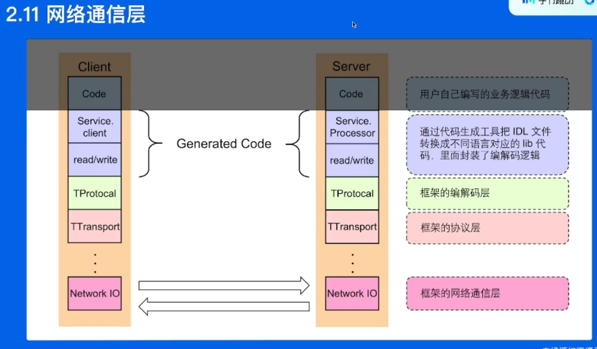
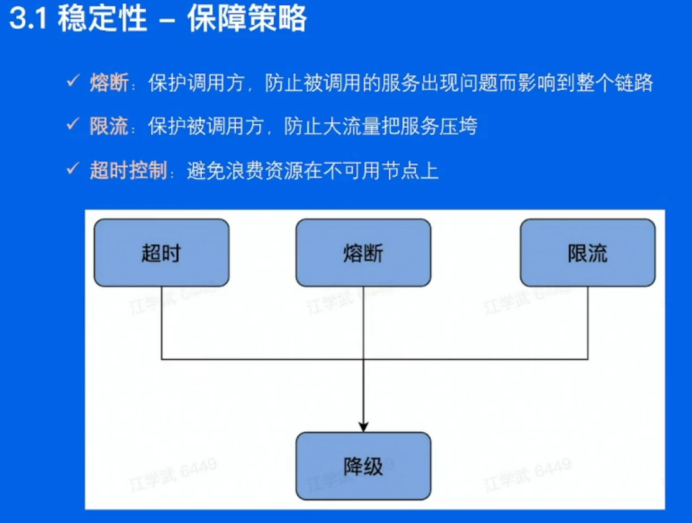

# 深入浅出RPC框架

## 目录

- 01 关键概念
- 02 分层设计
- 03 关键指标
- 04 企业实践

## 01 基本概念

ubuntu下选择指定区域截屏并且放入剪贴板: shift + ctrl + prtsc

远程调用

- 不同进程,给函数绑定ID
- 不同进程,数据要转换成字节流
- 高校稳定传输数据

## 02 分层设计

## 03 关键指标

- 稳定性
- 易用性
- 扩展性
- 观测性
- 高性能

## 04 企业实践

- 整体架构
- 自研网络库
- 扩展性设计
- 性能优化
- 合并部署

## Q&A

- thrift和protobuf编码方式的不同
- rpc的协议层是在TCP之上构造的,可以认为是一种应用层协议
- tag和length字段的长度是固定的
- rpc和gin中间件的区别
- 其实今天来看protobuf的生态比thrift要好
- 观测三件套: 
  - log,日志,日志平台,log agent;
  - metrics,打点,计算耗时,上报agent,传输到一个地方,平台集中化展示;普罗米休斯(时序数据库),个如埃弗呢(展示平台)
  - tracing,跟踪链路在每个阶段的耗时,雅各,展示平台;
- 服务发现
  - etcd
  - 看色呢
- 服务发现是框架实现的还是依赖第三方注册中心?
  - kitex也要对接第三方注册中心
- k8s调度实现负载均衡
- 大部分人会选择RPC框架
  - 灵活性
  - 功能多,能覆盖http服务
- k8s支持的节点数量有限,弹幕有人说的

