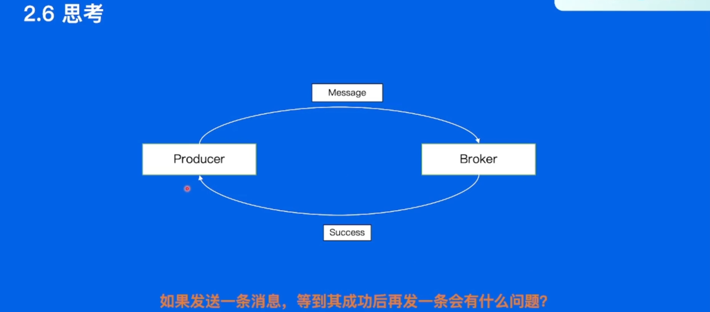
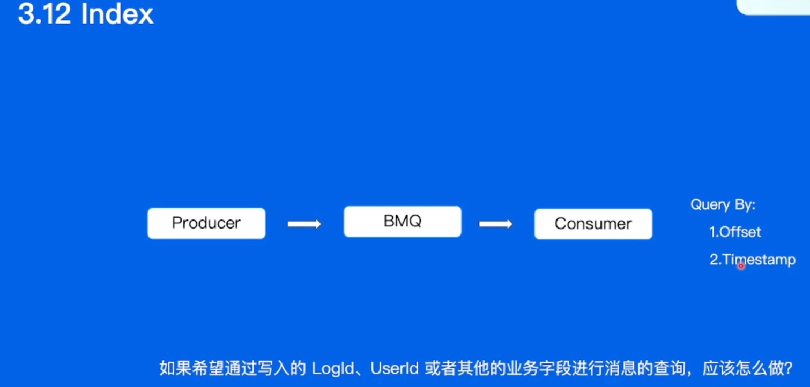

# 第十六节：走进消息队列

## 概述

本节课程主要分为五个方面：

1. 消息队列的前世今生
2. 消息队列-Kafka
3. 消息队列-BMQ
4. 消息队列-RocketMQ
5. 最佳实践

课前部分主要罗列课程中涉及到的概念。对于不熟悉的概念，同学们可以提前查询预习；课中部分主要罗列每一部分的关键思路，帮助同学们跟上课程的进度；课后部分是一些问题，帮助同学们在课后梳理本课程的重点。

## 课前

### 消息队列的前世

- 消息队列应用场景

- 消息队列的发展历史

### 常见消息队列

- Kafka使用场景、架构、高级特性

- Pulsar使用场景、架构、高级特性

- Rocket使用场景、架构、高级特性

## 课中

### 消息队列是什么

- 解耦

- 削峰

- 异步

- 日志处理

### 消息队列的前世今生

#### 消息队列-Kafka

kafka使用场景，业务日志、用户行为数据、Metrics数据

基本概念，Producer、Cluster、Consumer、Topic、Partition

数据迁移、Offset、Partition选主

一条消息从生产到消费是如何处理的，Producer端逻辑、Broker端逻辑、Consumer端逻辑

#### 消息队列-BMQ

Kafka在使用中遇到问题

BMQ架构

BMQ各模块是如何工作的，Broker、Proxy、HDFS、MetaStorage

BMQ多机房容灾

#### 消息队列-RocketMQ

RocketMQ使用场景

RocketMQ和Kafka对比

RocketMQ架构介绍，Producer、Broker、Nameserver、Consumer

一条消息从生产到消费是如何处理的，Producer端逻辑、Broker端逻辑、Consumer端逻辑

#### 消息队列在字节

一些最佳实践的场景，包括数据展示

### 课后作业：

1. 消息队列的应用场景有哪些？
2. Kafka 的哪些 Feature 让其可以支撑大吞吐写入的场景？
3. Kafka Consumer Rebalance 的流程简述？
4. BMQ 相比较 Kafka 有哪些优势？
5. RocketMQ 有哪些特有的 Feature？
6. RocketMQ 事务消息处理流程简述？
7. 你认为 MQ 后面应该如何发展？（开放题）

作者：社区助手
链接：https://juejin.cn/post/7100199258900398093/
来源：稀土掘金
著作权归作者所有。商业转载请联系作者获得授权，非商业转载请注明出处。

推荐使用ZSTD

自动分配

Proxy和Broker都是无状态的，读写分离

同一个partition的所有segment打散到整个集群上

RocketMQ

- 幂等性需要业务逻辑自己保证

